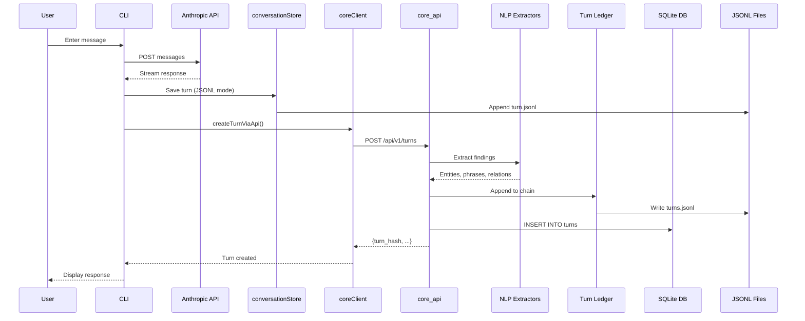
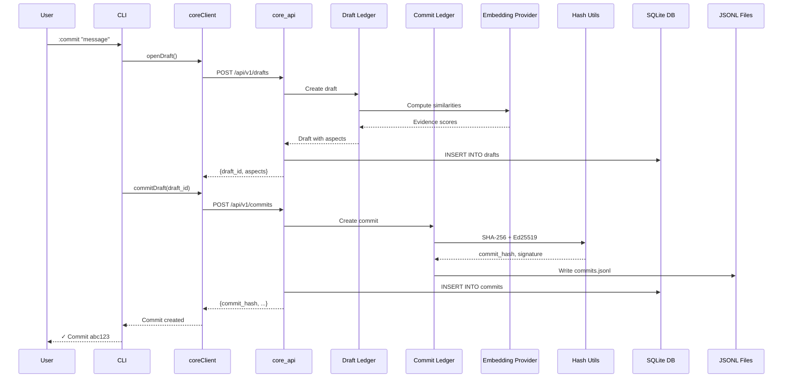
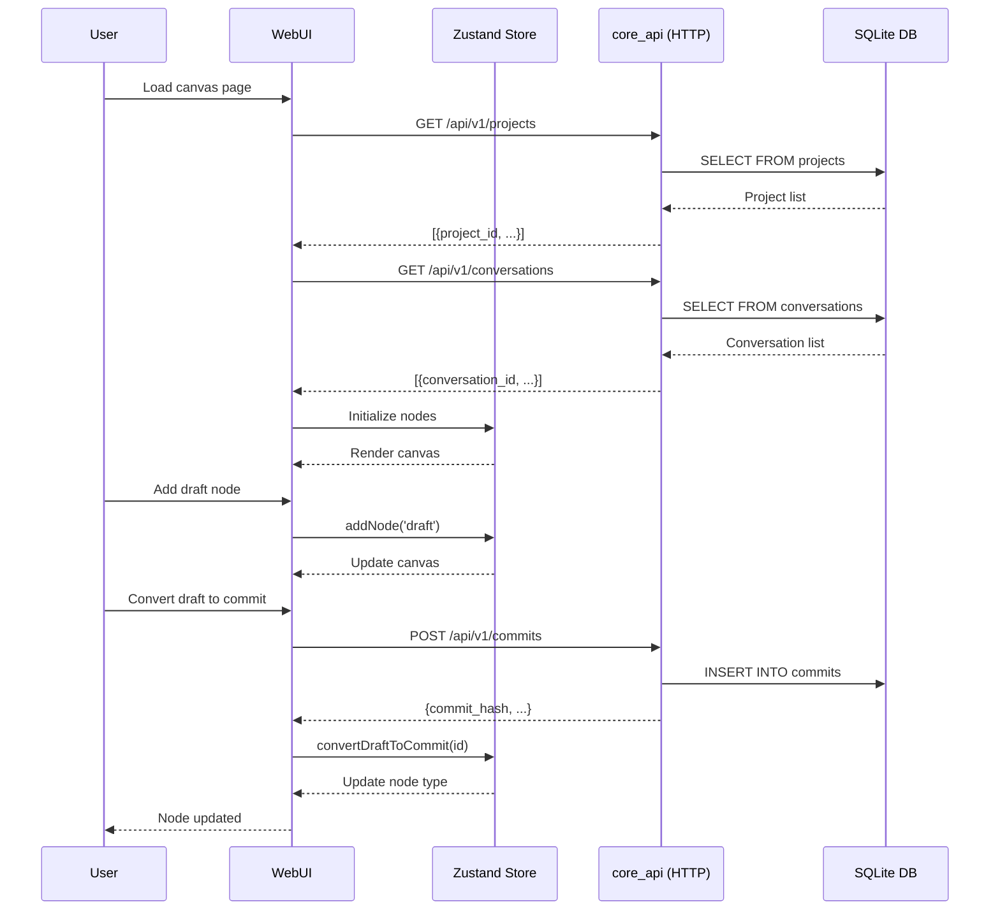
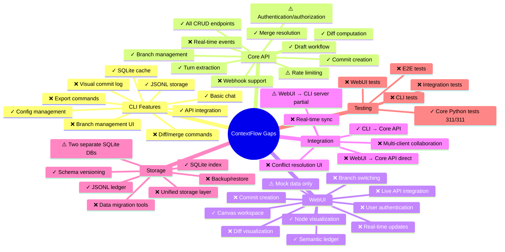

# ContextFlow Complete Architecture Atlas

## System Overview Diagram

```mermaid
graph TB
    subgraph USER["👤 User Interface Layer"]
        CLI[CLI Interactive Shell]
        WEBUI[React WebUI Dashboard]
    end

    subgraph CLIAPP["🖥️ contextflow-cli (Node.js/TypeScript)"]
        subgraph CLIMODES["Shell Modes"]
            CHATMODE[Chat Mode]
            CONFIGMODE[Config Mode]
        end

        subgraph CLICORE["Core Modules"]
            CONFIG[config.ts<br/>~/.contextflow/config.json]
            CONVSTORE[conversationStore.ts<br/>JSONL persistence]
            CORECLIENT[coreClient.ts<br/>HTTP client for core_api]
            DB[db.ts<br/>Local SQLite cache]
            PROJECTCACHE[projectCache.ts<br/>Project metadata]
            ROOT[root.ts<br/>.contextflow/ discovery]
            VALIDATE[validate.ts<br/>Schema validation]
            CANON[canon.ts<br/>JCS canonicalization]
            HASH[hash.ts<br/>SHA-256 hashing]
        end

        subgraph CLIPROV["Providers"]
            CLAUDE[claude.ts<br/>Anthropic Messages API]
        end

        subgraph CLISERVER["Local API Server"]
            SERVER[server.ts<br/>HTTP :8765]
        end

        subgraph CLISQLITE["CLI SQLite Tables"]
            CLITABLE1[(meta)]
            CLITABLE2[(events)]
            CLITABLE3[(turns)]
            CLITABLE4[(drafts)]
            CLITABLE5[(commits)]
            CLITABLE6[(embeddings)]
        end
    end

    subgraph COREAPI["🐍 contextflow-core (Python)"]
        subgraph APIROUTES["FastAPI Routes"]
            HEALTH[health.py<br/>GET /health<br/>GET /api/v1/status]
            PROJECTS[projects.py<br/>POST/GET /api/v1/projects]
            CONVERSATIONS[conversations.py<br/>POST/GET /api/v1/conversations]
            TURNS[turns.py<br/>POST/GET /api/v1/turns]
            COMMITS[commits.py<br/>POST/GET /api/v1/commits]
            BRANCHES[branches.py<br/>POST/GET/DELETE /api/v1/branches<br/>POST /api/v1/branches/switch<br/>GET /api/v1/branches/current]
            DIFF[diff.py<br/>POST /api/v1/diff]
            MERGE[merge.py<br/>POST /api/v1/merge]
            EXPORT[export.py<br/>GET /api/v1/export/cfpack<br/>GET /api/v1/export/ledger]
            AGENT[agent.py<br/>POST/GET/PATCH /api/v1/drafts]
        end

        subgraph COREMODULES["Core Engine Modules"]
            subgraph EXTRACTORS["Extractors (NLP)"]
                RINGEXT[ring_extractor.py<br/>Ring 1/2/3 NLP]
                JIEBAEXT[jieba_extractor.py<br/>Chinese segmentation]
                BASEEXT[base.py<br/>Base extractor]
                POLARITY[polarity_rules.py<br/>Sentiment analysis]
            end

            subgraph LEDGERS["Ledger System"]
                TURNLEDGER[turn_ledger.py<br/>Turn chain]
                COMMITLEDGER[commit_ledger.py<br/>Commit chain]
                DRAFTLEDGER[draft_ledger.py<br/>Draft management]
                HASHUTILS[hash_utils.py<br/>SHA-256 + Ed25519]
            end

            subgraph DRAFTSYS["Draft System"]
                WORKFLOW[workflow.py<br/>Draft workflow]
                VALIDATOR[validator.py<br/>Draft validation]
            end

            subgraph DIFFMERGE["Diff & Merge"]
                DIFFENG[engine.py<br/>Semantic diff]
                DIFFTYPES[types.py<br/>Diff types]
            end

            subgraph EMBEDDING["Embedding"]
                EMBPROV[provider.py<br/>sentence-transformers]
            end

            subgraph LLMPROV["LLM Providers"]
                OPENAI[openai_provider.py<br/>OpenAI client]
            end

            subgraph AGENTS["Optional Agents"]
                MERGEAGENT[merge_agent.py<br/>Conflict resolution]
            end

            subgraph BRIDGES["Bridges"]
                LOADER[loader.py<br/>Template loader]
            end

            subgraph STORAGE["Storage Layer"]
                DBMOD[database.py<br/>SQLite operations]
                SCHEMA[schema.py<br/>Schema definitions]
            end
        end

        subgraph CORESQLITE["Core API SQLite Tables"]
            CORETABLE1[(projects)]
            CORETABLE2[(conversations)]
            CORETABLE3[(turns)]
            CORETABLE4[(commits)]
            CORETABLE5[(drafts)]
            CORETABLE6[(diffs)]
            CORETABLE7[(merge_results)]
            CORETABLE8[(branches)]
        end

        subgraph JSONLLEDGER["JSONL Ledger Files"]
            JSONL1[/turns.jsonl/]
            JSONL2[/commits.jsonl/]
        end
    end

    subgraph WEBUIAPP["⚛️ contextflow-webui (React/Vite)"]
        subgraph PAGES["Pages"]
            CANVASPAGE[CanvasWorkspace.tsx<br/>Interactive canvas]
            LEDGERPAGE[SemanticLedgerPage.tsx<br/>Timeline view]
            DETAILPAGE[WorkflowDetailPage.tsx<br/>Workflow detail]
        end

        subgraph COMPONENTS["Components"]
            CANVASNODES[CanvasNodes.tsx<br/>ReactFlow nodes]
            NODEMODAL[NodeModal.tsx<br/>Detail modal]
            SEMCARD[SemanticCard.tsx<br/>Aspect cards]
            TOPNAV[TopNav.tsx<br/>Navigation]
        end

        subgraph STORES["Zustand Stores"]
            CANVASSTORE[canvasStore.ts<br/>Canvas state, nodes, edges]
            WORKFLOWSTORE[workflowStore.ts<br/>Workflow data]
        end

        subgraph DATATYPES["Data & Types"]
            NODETYPES[nodes.ts<br/>Node type definitions]
            SEMTYPES[semantic.ts<br/>Semantic types]
            SAMPLEDATA[sampleLedger.ts<br/>Mock data]
            WORKFLOWS[workflows.ts<br/>Workflow fixtures]
        end
    end

    subgraph EXTERNALSVC["🌐 External Services"]
        ANTHROPIC[Anthropic Claude API<br/>claude-sonnet-4.5]
        OPENAIGPT[OpenAI API<br/>GPT models]
        SPACYMODELS[spaCy Models<br/>en_core_web_sm<br/>zh_core_web_sm]
        STMODELS[sentence-transformers<br/>MiniLM embeddings]
    end

    %% User interactions
    CLI --> CHATMODE
    CLI --> CONFIGMODE
    WEBUI --> CANVASPAGE
    WEBUI --> LEDGERPAGE
    WEBUI --> DETAILPAGE

    %% CLI internal flows
    CHATMODE --> CONVSTORE
    CHATMODE --> DB
    CHATMODE --> CLAUDE
    CHATMODE --> CORECLIENT
    CONFIGMODE --> CONFIG

    CONVSTORE --> CLITABLE3
    DB --> CLITABLE1
    DB --> CLITABLE2
    DB --> CLITABLE3
    DB --> CLITABLE4
    DB --> CLITABLE5
    DB --> CLITABLE6

    CORECLIENT --> HEALTH
    CORECLIENT --> PROJECTS
    CORECLIENT --> CONVERSATIONS
    CORECLIENT --> TURNS
    CORECLIENT --> COMMITS
    CORECLIENT --> BRANCHES
    CORECLIENT --> DIFF
    CORECLIENT --> AGENT

    PROJECTCACHE --> CORECLIENT
    SERVER --> DB
    SERVER --> CORECLIENT

    %% CLI to external
    CLAUDE --> ANTHROPIC

    %% Core API internal flows
    PROJECTS --> CORETABLE1
    CONVERSATIONS --> CORETABLE2
    TURNS --> CORETABLE3
    TURNS --> TURNLEDGER
    TURNS --> RINGEXT
    TURNS --> JIEBAEXT
    COMMITS --> CORETABLE4
    COMMITS --> COMMITLEDGER
    BRANCHES --> CORETABLE8
    AGENT --> CORETABLE5
    DIFF --> CORETABLE6
    DIFF --> DIFFENG
    MERGE --> CORETABLE7
    MERGE --> MERGEAGENT

    TURNLEDGER --> JSONL1
    COMMITLEDGER --> JSONL2
    TURNLEDGER --> HASHUTILS
    COMMITLEDGER --> HASHUTILS

    RINGEXT --> EMBPROV
    WORKFLOW --> DRAFTLEDGER
    DIFFENG --> DIFFTYPES
    MERGEAGENT --> OPENAI

    DBMOD --> CORETABLE1
    DBMOD --> CORETABLE2
    DBMOD --> CORETABLE3
    DBMOD --> CORETABLE4
    DBMOD --> CORETABLE5
    DBMOD --> CORETABLE6
    DBMOD --> CORETABLE7
    DBMOD --> CORETABLE8

    %% Core to external
    RINGEXT --> SPACYMODELS
    JIEBAEXT --> SPACYMODELS
    EMBPROV --> STMODELS
    OPENAI --> OPENAIGPT

    %% WebUI internal flows
    CANVASPAGE --> CANVASSTORE
    CANVASPAGE --> CANVASNODES
    CANVASPAGE --> NODEMODAL
    LEDGERPAGE --> SEMCARD
    DETAILPAGE --> WORKFLOWSTORE

    CANVASSTORE --> NODETYPES
    CANVASNODES --> NODETYPES
    WORKFLOWSTORE --> WORKFLOWS

    %% WebUI to backend
    WEBUI -.HTTP.-> SERVER
    WEBUI -.HTTP.-> HEALTH
    WEBUI -.HTTP.-> PROJECTS
    WEBUI -.HTTP.-> CONVERSATIONS
    WEBUI -.HTTP.-> TURNS
    WEBUI -.HTTP.-> COMMITS
    WEBUI -.HTTP.-> BRANCHES

    classDef userLayer fill:#e1f5ff,stroke:#01579b,stroke-width:2px
    classDef cliLayer fill:#fff3e0,stroke:#e65100,stroke-width:2px
    classDef coreLayer fill:#f3e5f5,stroke:#4a148c,stroke-width:2px
    classDef webuiLayer fill:#e8f5e9,stroke:#1b5e20,stroke-width:2px
    classDef externalLayer fill:#fce4ec,stroke:#880e4f,stroke-width:2px
    classDef storageNode fill:#fff9c4,stroke:#f57f17,stroke-width:2px

    class CLI,WEBUI userLayer
    class CLIAPP,CLIMODES,CLICORE,CLIPROV,CLISERVER,CLISQLITE cliLayer
    class COREAPI,APIROUTES,COREMODULES,CORESQLITE,JSONLLEDGER coreLayer
    class WEBUIAPP,PAGES,COMPONENTS,STORES,DATATYPES webuiLayer
    class EXTERNALSVC externalLayer
    class CLITABLE1,CLITABLE2,CLITABLE3,CLITABLE4,CLITABLE5,CLITABLE6 storageNode
    class CORETABLE1,CORETABLE2,CORETABLE3,CORETABLE4,CORETABLE5,CORETABLE6,CORETABLE7,CORETABLE8 storageNode
    class JSONL1,JSONL2 storageNode
```



## Data Flow: Turn Creation



## Data Flow: Commit Creation



## Data Flow: WebUI Canvas Interaction



## CLI Commands Mapping

```mermaid
graph LR
    subgraph CHATCMDS["Chat Mode Commands"]
        HELP[/help - Show commands]
        NEW[/new NAME - Create project]
        PROJECT[/project - List/switch projects]
        CONFIG[/config - Enter config mode]
        CLEAR[/clear - Clear context]
        EXIT[/exit - Exit CLI]
    end

    subgraph CONFIGCMDS["Config Mode Commands"]
        API[/api KEY - Set API key]
        MODEL[/model NAME - Set model]
        PROXY[/proxy - View proxy]
        PARAM[/param - View params]
        FILE[/file - View paths]
        STREAM[/stream on|off - Toggle stream]
        BACK[/back - Return to chat]
    end

    subgraph COREFNS["Core Functions"]
        CREATETURN[createTurn]
        LISTTURN[listTurns]
        OPENDRAFT[openDraft]
        UPDATEDRAFT[updateDraft]
        COMMITDRAFT[commitDraft]
        STATUS[status]
    end

    subgraph APIFNS["API Functions"]
        CREATETURNAPI[createTurnViaApi]
        LISTTURNAPI[listTurnsViaApi]
        CREATEBRANCHAPI[createBranchViaApi]
        SWITCHBRANCHAPI[switchBranchViaApi]
        LISTBRANCHAPI[listBranchesViaApi]
        CURRENTBRANCHAPI[getCurrentBranchViaApi]
        LISTCOMMITSAPI[listCommitsViaApi]
        DIFFCOMMITSAPI[diffCommitsViaApi]
        CREATECOMMITAPI[createCommitViaApi]
        CREATEDRAFTAPI[createDraftViaApi]
        GETDRAFTAPI[getDraftViaApi]
        UPDATEDRAFTAPI[updateDraftViaApi]
    end

    CHATCMDS --> COREFNS
    CHATCMDS --> APIFNS
    CONFIGCMDS --> COREFNS
```

## Missing Components & Gaps Analysis



## Critical Missing Connections

1. **WebUI ↔ Core API Direct Connection**: WebUI currently uses mock data and doesn't directly connect to core_api
2. **CLI Branch Management UI**: CLI has API functions but no user-facing commands for branch operations
3. **Diff/Merge Commands in CLI**: Core API has diff/merge endpoints, but CLI doesn't expose them
4. **WebUI Real-time Features**: No WebSocket or SSE for live updates
5. **Unified Storage**: CLI and core_api use separate SQLite databases with overlapping schemas
6. **Authentication**: No auth layer across any component
7. **Test Coverage**: Only Python core has comprehensive tests

## Data Schema Divergence

**CLI SQLite** vs **Core API SQLite**:
- Both have `turns`, `drafts`, `commits` tables but with different schemas
- CLI has `events`, `meta`, `embeddings`
- Core API has `projects`, `conversations`, `branches`, `diffs`, `merge_results`
- **Gap**: No sync mechanism between the two databases

## Legend
- ✓ Complete/Working
- ⚠️ Partial/Needs improvement
- ❌ Missing/Not implemented
