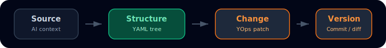

<p align="center">
  
</p>

<h1 align="center">T3X</h1>

<p align="center">
  <strong>Git for structured AI work.</strong>
</p>

<p align="center">
  <a href="https://t3x-docs.vercel.app">Docs</a> &middot;
  <a href="https://t3x.dev">Website</a> &middot;
  <a href="https://discord.gg/t3x">Community</a>
</p>

<p align="center">
  <a href="./LICENSE"></a>
  
  <a href="https://github.com/t3x-dev/t3x-core/actions/workflows/pr-validation.yml"></a>
</p>

<br/>

<p align="center">
  
</p>

<br/>

T3X is an early-stage system for turning AI context into structured, versioned
work. It extracts meaning from conversations, documents, transcripts, specs, and
notes into YAML trees; changes those trees through deterministic YOps; then
tracks the resulting structure with commits, diffs, merges, and leaves.

The current restricted alpha npm release surface is limited to `@t3x-dev/local`
and `@t3x-dev/yops`. Restricted package or runtime-asset visibility is expected
during this alpha; other packages remain internal or preview until promoted
through the release surface process in [`RELEASE.md`](RELEASE.md).

<br/>

## Quickstart

Choose the shortest path for what you want to do:

### Use YOps as a library

```bash
npm install @t3x-dev/yops
```

Use this if you want the deterministic YAML operation engine inside your own app.
If npm returns a not-found or access error, your account likely does not have
restricted alpha access.

### Use the local alpha package

```bash
npx -p @t3x-dev/local t3x-local start
```

Use this if you want the packaged local T3X experience. `@t3x-dev/local`
downloads its runtime artifact during install instead of depending on the
internal workspace packages being published to npm. If the package or runtime
asset is not visible, check restricted alpha access.

### Preview the self-hosted stack with Docker

```bash
cp .env.example .env
docker compose up -d --build
```

> **WebUI** &rarr; [localhost:3000](http://localhost:3000) &nbsp;|&nbsp; **API** &rarr; [localhost:8000](http://localhost:8000)

Use this if you want the self-hosted alpha evaluation path with WebUI + API +
Postgres. Docker Compose is a preview path for local/self-hosted evaluation, not
a production-readiness claim. Review the [deployment guide](DEPLOYMENT.md)
before exposing it beyond localhost. Docker and self-hosted runs keep auth on by
default, so the first WebUI visit goes through the built-in username/password
login at `/login`.

### Develop from source

```bash
git clone https://github.com/t3x-dev/t3x-core.git && cd t3x-core
pnpm install
pnpm dev:api     # API at localhost:8000
pnpm dev:webui   # WebUI at localhost:3000
```

Requires Node.js 20+ and pnpm 10+.

Use this if you want to contribute to T3X itself or run the source-first apps locally.
When `AUTH_DISABLED` is unset, `pnpm dev:api` and `pnpm dev:webui` default to source-dev mode and open straight into the app on `localhost`.
Set `AUTH_DISABLED=false` in the shell where you start both dev processes if you want to exercise the login flow during local source development.

<br/>

## WebUI preview

<p align="center">
  
</p>

The fresh `/chat` view shows a provider-independent `Source -> Meaning -> Commit`
preview before the first extraction run. Screenshot assets live in the docs site
so the core repository does not need to carry generated image files.

When the source-dev WebUI is running, open the
[intro demo preview](http://localhost:3000/chat?introDemo=1) to load the guided
intro demo. The `introDemo` flag is development-only.

<br/>

## How it works

T3X turns messy AI context into structured state, then versions that state.

<table>
<tr>
<td width="25%" align="center"><strong>Source</strong></td>
<td width="25%" align="center"><strong>Structure</strong></td>
<td width="25%" align="center"><strong>Change</strong></td>
<td width="25%" align="center"><strong>Version</strong></td>
</tr>
<tr>
<td align="center"><sub>Conversations, docs, specs, notes, transcripts</sub></td>
<td align="center"><sub>Extract reviewable YAML trees</sub></td>
<td align="center"><sub>Apply deterministic YOps</sub></td>
<td align="center"><sub>Commit, diff, branch, merge, generate</sub></td>
</tr>
<tr>
<td align="center"><code>raw text</code></td>
<td align="center"><code>structured tree</code></td>
<td align="center"><code>old tree + YOps -> new tree</code></td>
<td align="center"><code>committed state</code></td>
</tr>
</table>

> Extract and Generate can use LLMs. YOps Apply, validation, commit hashing, diff, and merge are deterministic.

The key idea: commits store structured tree state, while YOps records the
deterministic change from one valid state to the next. Diff and merge compare
committed structured states; fixes and merges are applied back through YOps
before a new commit is written.

Between extraction and commit, the tree goes through a **validate &rarr; fix
&rarr; re-validate** loop powered by the Y-family tools. This is where the
quality happens &mdash; deterministic checks catch issues, emit YOps fixes, and the
user approves or adjusts before committing.

<br/>

## The Y-Family

T3X provides three spec-driven tools for working with YAML trees. Together they form a validate-and-fix loop: detect issues, emit fix operations, apply them, confirm.
Within this Y-family, only YOps is part of the restricted alpha npm release
surface. YSchema and YLint are in-repository validation surfaces used by T3X and
may change before promotion; treat their examples as source-level documentation,
not published-package install guidance.

<table>
<tr>
<th width="33%">YOps</th>
<th width="33%">YSchema</th>
<th width="33%">YLint</th>
</tr>
<tr>
<td><strong>How to mutate</strong></td>
<td><strong>What is valid</strong></td>
<td><strong>Is it clean</strong></td>
</tr>
<tr>
<td>Atomic YAML operations<br/>Spec-driven, deterministic<br/>Sequential, fail-fast</td>
<td>User-defined domain schemas<br/>Slot types, enums, ranges<br/>Cross-node rules</td>
<td>Built-in structural rules<br/>Runs without a schema<br/>Auto-fix via YOps</td>
</tr>
<tr>
<td><a href="packages/yops/yops.yaml"><code>yops.yaml</code></a></td>
<td><a href="packages/yschema/yschema.yaml"><code>yschema.yaml</code></a></td>
<td>Built into <code>@t3x-dev/core</code></td>
</tr>
</table>

From the user's perspective, two functions cover the whole system:

```typescript
applyYOps(doc, ops)              // mutate: apply operations to a YAML tree
validateTree(content, { schema }) // validate: check structure + domain, get fixes
```

`validateTree` runs ylint and yschema internally, collects all warnings, and returns a ready-to-apply fix plan. Auto-fixable issues are resolved via `applyYOps()`. What can't be auto-fixed is surfaced for human review.

### YOps &mdash; Declarative YAML Operations

```yaml
yops:
  - define:
      path: user/preferences
  - populate:
      path: user/preferences
      values: { theme: dark, language: en }
  - sort:
      path: user/tags
  - assert:
      path: user/preferences/theme
      equals: dark
```

<table>
<tr><th>Category</th><th>Ops</th><th>Purpose</th></tr>
<tr><td><strong>DDL</strong></td><td><code>define</code> <code>drop</code> <code>rename</code></td><td>Create, remove, rename keys</td></tr>
<tr><td><strong>DML</strong></td><td><code>set</code> <code>unset</code> <code>populate</code> <code>append</code></td><td>Set values, add to sequences</td></tr>
<tr><td><strong>DTL</strong></td><td><code>move</code> <code>clone</code> <code>nest</code> <code>split</code> <code>fold</code> <code>merge</code> <code>sort</code> <code>unique</code> <code>pick</code> <code>omit</code></td><td>Reshape the tree</td></tr>
<tr><td><strong>DCL</strong></td><td><code>assert</code></td><td>Validate conditions (read-only)</td></tr>
</table>

The full spec &mdash; including a decision guide, type contracts, composition recipes, and error reference &mdash; lives in [`yops.yaml`](packages/yops/yops.yaml). Any language can implement a conformant engine from this single file.

### YSchema &mdash; Domain Validation

Define what a valid tree looks like for your use case. Violations emit YOps fix operations.

```yaml
name: customer-profile
nodes:
  preferences:
    required: true
    slots:
      theme: [dark, light, system]
      language: scalar
  decisions:
    required: true
    children: any
    each_child:
      slots:
        choice: scalar
        reason: scalar
rules:
  - id: decisions-need-reason
    if: "decisions/*"
    must_have: [choice, reason]
    severity: error
```

`validateSchema()` checks the tree. `buildFixPlan()` collects fixable violations into YOps operations. `applyYOps()` applies them. &rarr; [YSchema spec](packages/yschema/yschema.yaml)

### YLint &mdash; Structural Checks

Built-in structural rules that run without a schema &mdash; checks key naming, value quality, list hygiene, and tree depth. When issues are auto-fixable, ylint emits YOps operations directly.

<br/>

### Configuration

```
~/.t3x/config.json          # API keys, default server URL
<project>/.t3x/config.json  # Project-specific settings
```

For one-machine local product use, CLI (`t3x auth/config`) and MCP read the
machine-level `~/.t3x/config.json`, and WebUI (`/settings/access`) manages that
same file through the standalone API. Effective lookup order is:

```text
T3X_API_URL / T3X_API_KEY (environment)
-> ~/.t3x/config.json
-> built-in defaults
```

Environment variables always win over the shared file.

After changing local access settings, use `t3x auth check` or the WebUI
`Test Access` action in `/settings/access` to verify the effective API URL, and
whether the current deployment requires or accepts the configured key.

Copy `.env.example` to `.env` to add provider keys for source development or to make auth settings explicit for Docker and other self-hosted deployments.

The core engine works without any API key. To use extraction or chat, add an Anthropic, OpenAI, or Google AI Studio key.

First-run auth defaults:

- Source development (`pnpm dev:api`, `pnpm dev:webui`) opens directly into the app by default.
- To exercise the login flow in source development, set `AUTH_DISABLED=false` in the shell before starting both dev processes.
- Docker and self-host keep auth on by default and use the built-in username/password login.

<br/>

## Use T3X

### Local alpha

```bash
npx -p @t3x-dev/local t3x-local start
```

Use this for packaged local alpha evaluation. Some local alpha flows may depend
on restricted runtime assets during alpha.

### YOps library

```bash
npm install @t3x-dev/yops
```

Use this for the deterministic YAML operation engine inside your own app.

### Docker self-host preview

```bash
cp .env.example .env
docker compose up -d --build
```

Use this to preview the self-hosted WebUI + API + Postgres stack. See the
[deployment guide](DEPLOYMENT.md) for auth, environment, and production caveats.

### WebUI from source

Run `pnpm dev:api` and `pnpm dev:webui` from a source checkout when you want to
work on the full self-hostable product.

### Preview surfaces

CLI, MCP, API, and runner surfaces are available for preview and internal
integration work, but they are not part of the current restricted alpha package
surface. Their commands and contracts may change before promotion.

<br/>

## Architecture

<table>
<tr><td align="center"><strong>Product</strong><br/><sub>WebUI (Next.js) &middot; API (Hono) &middot; CLI &middot; MCP</sub></td></tr>
<tr><td align="center"><strong>Storage</strong><br/><sub>PostgreSQL (Drizzle ORM) &middot; Embedded PG (dev)</sub></td></tr>
<tr><td align="center"><strong>Core</strong><br/><sub>Hash chains &middot; Diff engine &middot; Merge &middot; YLint &middot; Extract</sub></td></tr>
<tr><td align="center"><strong>Y-Family</strong><br/><sub>YOps (mutate) &middot; YSchema (validate) &middot; YLint (hygiene)</sub></td></tr>
</table>

**Design principles:**

- **Deterministic core** &mdash; Same inputs, same outputs. No LLM in the critical path.
- **Append-only** &mdash; Hash chains are immutable.
- **Evidence-backed** &mdash; Every finding traces to source text with character offsets.
- **Pluggable** &mdash; LLMs are optional plugins for extraction, never required.

### Project structure

```
packages/yops        # YOps — Declarative YAML operations
packages/yschema     # YSchema — internal validation candidate with auto-fix
packages/core        # T3X engine — diff, merge, hash chains, extraction, ylint
packages/storage     # PostgreSQL persistence (Drizzle ORM)
packages/api-client  # TypeScript API client
apps/web             # WebUI (Next.js 16 + App Router)
apps/api             # Hono API server with OpenAPI
apps/cli             # Command-line interface
apps/mcp             # MCP server (tools)
apps/runner          # Grey-box agent evaluation engine
```

### Build

```bash
pnpm build           # Build all packages
pnpm test            # Run all tests
pnpm check           # Lint + format (Biome)
```

&rarr; [Contributing guide](./CONTRIBUTING.md)

<br/>

## Release Surface

The alpha package surface is declared in [`RELEASE.md`](RELEASE.md) and
[`release/surface.yaml`](release/surface.yaml). `release/surface.yaml` is the
machine-readable source of truth used by release automation.

| Package | Status | Description |
|:--------|:----|:------------|
| [`@t3x-dev/local`](apps/local/) | restricted alpha | Local installer and no-key demo entrypoint |
| [`@t3x-dev/yops`](packages/yops/) | restricted alpha | Declarative YAML operations |

Other packages remain internal or preview candidates until explicitly promoted.

<br/>

## Documentation

[t3x-docs.vercel.app](https://t3x-docs.vercel.app) &mdash; Quickstart, Local alpha, YOps reference, WebUI guide, and preview surfaces.

Release governance:

- [Security policy](SECURITY.md)
- [Alpha limitations](LIMITATIONS.md)
- [Deployment guide](DEPLOYMENT.md)
- [Stability summary](STABILITY.md)

<br/>

## License

[Apache License 2.0](./LICENSE)
