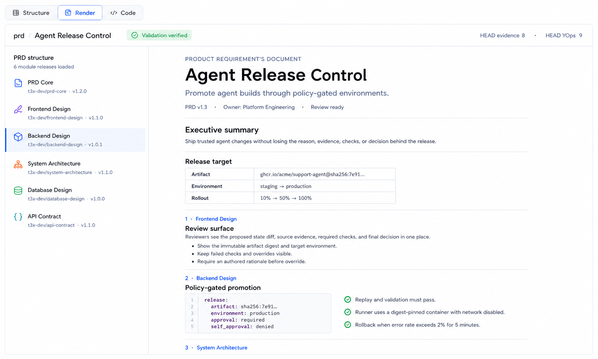
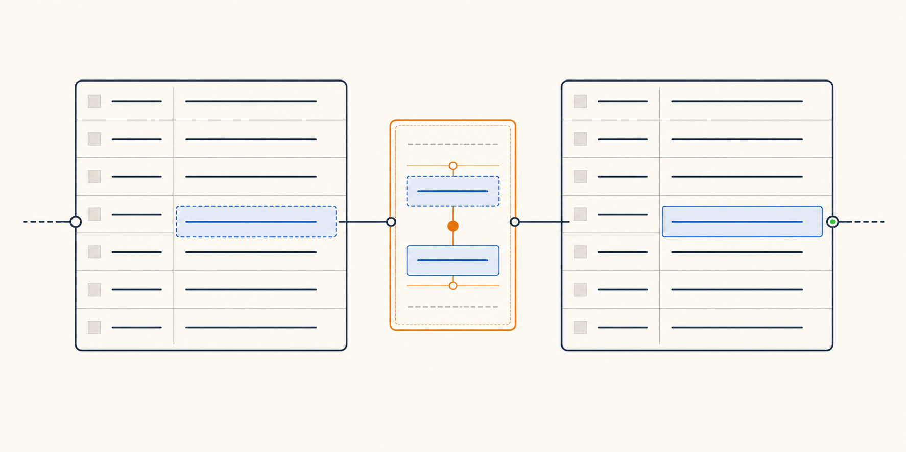
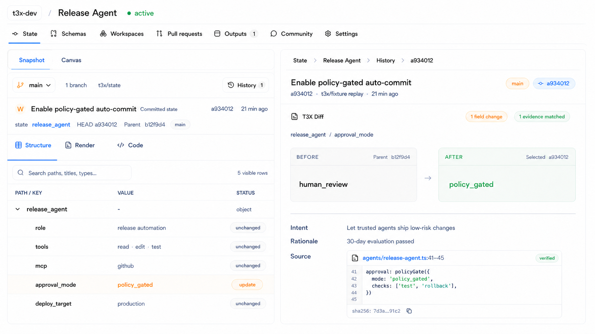

<p align="center">
  
</p>

<h1 align="center">T3X</h1>

<p align="center">
  <strong>Version control for structured state.</strong><br />
  <sub>Review, validate, and commit changes from people and agents.</sub>
</p>

<p align="center">
  <a href="https://docs.t3x.dev">Docs</a> &middot;
  <a href="https://www.t3x.dev">Website</a> &middot;
  <a href="#quickstart">Quickstart</a>
</p>

<p align="center">
  <a href="./LICENSE"></a>
  
  
</p>

T3X is a control plane for structured state changes. It gives people and agents
one place to propose, validate, review, and commit changes—with provenance and
reversible history.

State can be YAML or another machine-readable artifact. T3X can render it into
a human-facing form, such as a technical PRD, without losing the structured
source of truth.

<p align="center">
  
</p>

## Change as a verifiable object

Each transition binds the previous state and proposed change to the resulting
state, together with its source, rationale, checks, and decision.

<p align="center">
  
</p>

## Review before history moves

People and agents follow the same review path: propose a change, inspect the
diff, run checks, and decide whether it advances history.

<p align="center">
  
</p>

## Features

- **Review before commit.** Inspect the exact state diff before history moves.
- **Deterministic transitions.** Apply ordered, fail-fast YAML operations with
  [YOps](packages/yops/).
- **Checks that stay attached.** Run [YSchema](packages/yschema/) and external
  checks without hiding failures or overrides.
- **Decisions with provenance.** Keep source, rationale, actor, and evidence
  connected to the change they describe.
- **Reversible history.** Compare, branch, merge, and revert structured state
  without erasing how it changed.
- **One path for people and agents.** Agent proposals remain as reviewable as
  human changes.

## Quickstart

Run the public alpha locally:

```bash
npx -p @t3x-dev/local t3x-local
```

The launcher guides setup, starts the API and WebUI, and asks before opening a
browser. Use `--yes --no-open` for non-interactive evaluation.

### Develop from source

```bash
git clone https://github.com/t3x-dev/t3x-core.git
cd t3x-core
pnpm install
pnpm dev:api     # http://localhost:8000
pnpm dev:webui   # http://localhost:3000
```

Requires Node.js 20+ and pnpm 10+.

### Use the engines directly

```bash
npm install @t3x-dev/yops @t3x-dev/yschema
```

- **YOps** applies declarative YAML changes.
- **YSchema** validates schema-backed structured state and can produce
  YOps-compatible fixes.

Both packages can be used without the T3X application.

### Self-hosted evaluation

```bash
cp .env.example .env
docker compose up -d --build
```

WebUI: [localhost:3000](http://localhost:3000) · API:
[localhost:8000](http://localhost:8000)

Review the [deployment guide](docs/deployment.md) before exposing the stack
beyond localhost.

## Availability

T3X is in public alpha. Its published npm surface is intentionally narrow:

| Package | Status | Use |
|:--|:--|:--|
| [`@t3x-dev/local`](apps/local/) | public alpha | Run T3X locally |
| [`@t3x-dev/yops`](packages/yops/) | public alpha | Apply YAML operations |
| [`@t3x-dev/yschema`](packages/yschema/) | public alpha | Validate structured state |

The Transition protocol, WebUI, API, CLI, and MCP integrations remain internal
or preview surfaces and may change.

## Learn more

[Documentation](https://docs.t3x.dev) ·
[Alpha limitations](docs/limitations.md) ·
[Stability](docs/stability.md) ·
[Security](SECURITY.md) ·
[Contributing](CONTRIBUTING.md)

## License

[Apache License 2.0](./LICENSE)
