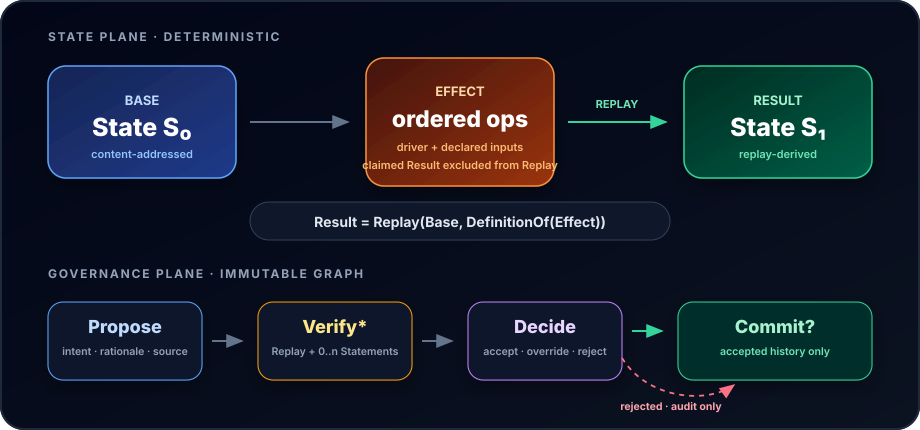
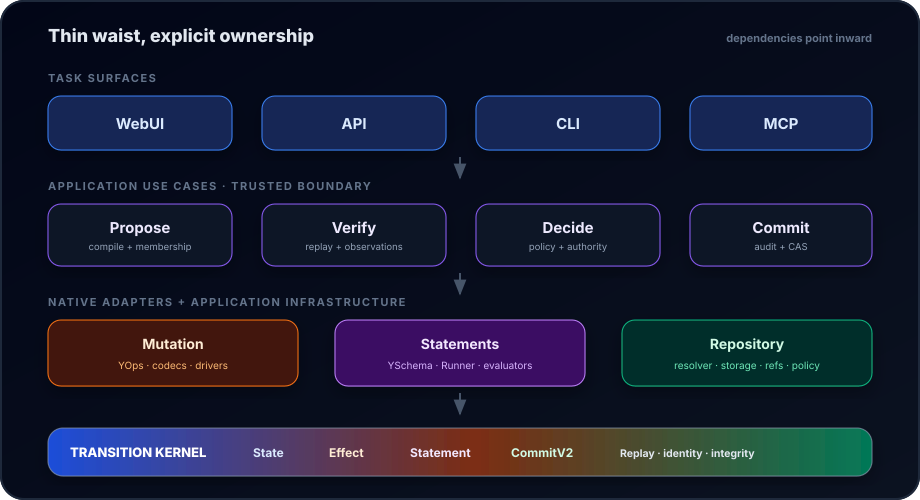

<p align="center">
  
</p>

<h1 align="center">T3X</h1>

<p align="center">
  <strong>Version control for structured state.</strong><br />
  <sub>Make every state change replayable, reviewable, and attributable.</sub>
</p>

<p align="center">
  <a href="https://docs.t3x.dev">Docs</a> &middot;
  <a href="https://www.t3x.dev">Website</a> &middot;
  <a href="#quickstart">Quickstart</a> &middot;
  <a href="#the-transition-model">Transition model</a>
</p>

<p align="center">
  <a href="./LICENSE"></a>
  
  
</p>

<p align="center">
  
</p>

## Change as a verifiable object

Structured state is easy to edit and hard to govern—especially when humans,
agents, validators, and external tools can all participate in one change.

T3X records more than the snapshot and diff. It binds a proposed state change
to the exact base it started from, the deterministic operation that produced
the result, the evidence and checks observed around it, the actor or policy
that accepted it, and the commit that advanced history.

| Replayable | Evidence-bound | Governed |
|:--|:--|:--|
| Recompute the Result from the pinned Base and Effect. | Keep source, rationale, validation, and runner claims as typed Statements. | Advance history only through an explicit accepted or authorized overridden Decision. |

The result is a complete state-transition record without pretending every
claim is equally trustworthy. Replay truth, validation results, acceptance,
and real-world outcomes stay distinct.

## The Transition model

<p align="center">
  
</p>

```text
Result = Replay(Base, DefinitionOf(Effect))
Propose -> Verify* -> Decide -> Commit?

CommitV2
  -> Decision Statement
  -> Proposal Statement
  -> Effect
  -> Base + operations + Result
```

State, Effect, Statement, and CommitV2 are the four public protocol objects
that form the thin waist:

| Object | What it records |
|:--|:--|
| **State** | Canonical structured content with a versioned codec. |
| **Effect** | Base, ordered operations, declared inputs, and the claimed Result. |
| **Statement** | A typed claim about an object—Proposal, Decision, validation, runner output, or another attestation. |
| **CommitV2** | The accepted history edge: parents, Decision, and Result. |

Proposal and Decision are closed Statement profiles rather than extra
envelopes. Validators and runners can add versioned external Statement types
without adding domain fields or lifecycle verbs to the kernel.

`Verify*` always includes deterministic Replay and may include zero or more
external checks. `Commit?` is conditional: rejected Decisions remain auditable
but never advance state history.

## What users see

The protocol is the spine, not the interface. Workspaces stay task-oriented:

1. **Propose a change** from a direct edit, source material, or an Agent.
2. **Review what changed** and where the explanation or evidence came from.
3. **Inspect checks separately**—Replay, YSchema, Runner, or another Statement provider.
4. **Decide explicitly**: approve, continue anyway when policy allows, or reject.
5. **Save a version** with immutable provenance, then diff, inspect, merge, or revert without deleting history.

Human and automated paths produce the same protocol records. Automation changes
who may request a Decision; it does not create an `auto=true` bypass.

## Quickstart

### Run the local alpha

```bash
npx -p @t3x-dev/local t3x-local
```

The launcher guides setup, starts the API and WebUI, and asks before opening a
browser. Use `--yes --no-open` for explicit non-interactive evaluation.

### Develop from source

```bash
git clone https://github.com/t3x-dev/t3x-core.git
cd t3x-core
pnpm install
pnpm dev:api     # http://localhost:8000
pnpm dev:webui   # http://localhost:3000
```

Requires Node.js 20+ and pnpm 10+. Source development opens directly into the
app by default. Set `AUTH_DISABLED=false` before starting both processes to
exercise the login flow.

### Use the deterministic engines

```bash
npm install @t3x-dev/yops @t3x-dev/yschema
```

```typescript
import { applyYOps } from '@t3x-dev/yops';
import { parseYSchema, validateTree } from '@t3x-dev/yschema';
```

YOps applies ordered, fail-fast YAML operations. YSchema defines domain
contracts and reports tree, relation, provenance, and review gaps. Both remain
independently useful outside the T3X product.

### Evaluate the self-hosted stack

```bash
cp .env.example .env
docker compose up -d --build
```

WebUI: [localhost:3000](http://localhost:3000) · API:
[localhost:8000](http://localhost:8000)

Docker Compose is an evaluation path, not a production-readiness claim. Review
the [deployment guide](docs/deployment.md) before exposing it beyond localhost.

## A small replayable change

```yaml
base:
  launch:
    region: us
    gates: [qa]

effect:
  - assert: { path: launch/region, equals: us }
  - set: { path: launch/region, value: eu }
  - append: { path: launch/gates, value: security_review }

result:
  launch:
    region: eu
    gates: [qa, security_review]
```

The `assert` makes the Effect base-sensitive. T3X hashes canonical objects,
replays the Effect without exposing its claimed Result to the mutation driver,
and verifies every Commit → Decision → Proposal → Effect link before trusting
the history entry.

## Independently useful parts

| Component | Role | Status |
|:--|:--|:--|
| [YOps](packages/yops/) | Deterministic, spec-driven YAML mutation | public alpha |
| [YSchema](packages/yschema/) | Domain validation and YOps-compatible fixes | public alpha candidate |
| [Transition](packages/transition/) | Canonical State/Effect/Statement/CommitV2 contracts, Replay, and verification | internal protocol surface |
| [Core](packages/core/) | Adapters, projections, diff/merge, extraction, and policy composition | internal |
| [Storage](packages/storage/) | Immutable object graph, audit ledgers, refs, and CAS | internal |
| WebUI / API / CLI / MCP | Task-oriented product and integration surfaces | preview |

The language-neutral
[conformance bundle](packages/transition/conformance/) is checked by both the
TypeScript kernel and an independent Python verifier. It pins canonical bytes,
domain-separated identity, Replay behavior, and integrity failures; it does
not declare the protocol a stable public release surface.

## Architecture

<p align="center">
  
</p>

The architecture unifies component relationships, not component internals.
YOps, YSchema, codecs, mutation drivers, storage, and external runners keep
their own contracts. One-way adapters compose them around the leaf Transition
kernel.

Design rules:

- **Deterministic state plane** — identical Base, Effect definition, driver semantics, and declared inputs produce the same Result.
- **Explicit governance plane** — evidence, validation, acceptance, and history advancement are separate records.
- **Content-addressed identity** — canonical objects and immutable references are re-hashed before trust.
- **Append-only history** — rejection is auditable; revert creates a new Transition rather than deleting an old one.
- **Task-first product** — UI and MCP consume derived projections instead of reimplementing policy or protocol semantics.
- **No LLM in Replay** — models may propose and explain; deterministic mutation and verification remain executable without them.

## Agents and MCP

T3X is designed for higher proposal throughput without granting Agents
unbounded mutation authority.

The API derives actor identity and scopes from authenticated credentials,
selects policy on the server, records Proposal and Statement membership, and
re-resolves the review facts before Decision or Commit. Accepted history still
uses the same CommitV2 path and expected-head compare-and-swap as a human flow.

The MCP server is a preview surface. Its opt-in, API-backed `transition`
toolset currently exposes proposal, inspection, Replay/verification, and
external Statement issuance. Decision/Commit MCP tools remain follow-up work;
the underlying trusted API application plane is already on `dev`.

See [the MCP package README](apps/mcp/README.md) for the current exact tool and
backend surface.

## Availability

T3X is a public alpha. The current npm release surface is intentionally narrow:

| Package | Status | Description |
|:--|:--|:--|
| [`@t3x-dev/local`](apps/local/) | public alpha | Local product launcher and runtime entrypoint |
| [`@t3x-dev/yops`](packages/yops/) | public alpha | Declarative YAML operations |
| [`@t3x-dev/yschema`](packages/yschema/) | public alpha | Schema validation candidate for structured state |

Other packages are internal or preview until promoted through
[`RELEASE.md`](RELEASE.md) and
[`release/surface.yaml`](release/surface.yaml).

## Documentation

[docs.t3x.dev](https://docs.t3x.dev) · [Documentation index](docs/README.md) ·
[Alpha limitations](docs/limitations.md) · [Deployment](docs/deployment.md) ·
[Stability](docs/stability.md) · [Security](SECURITY.md) ·
[Contributing](CONTRIBUTING.md)

## License

[Apache License 2.0](./LICENSE)
