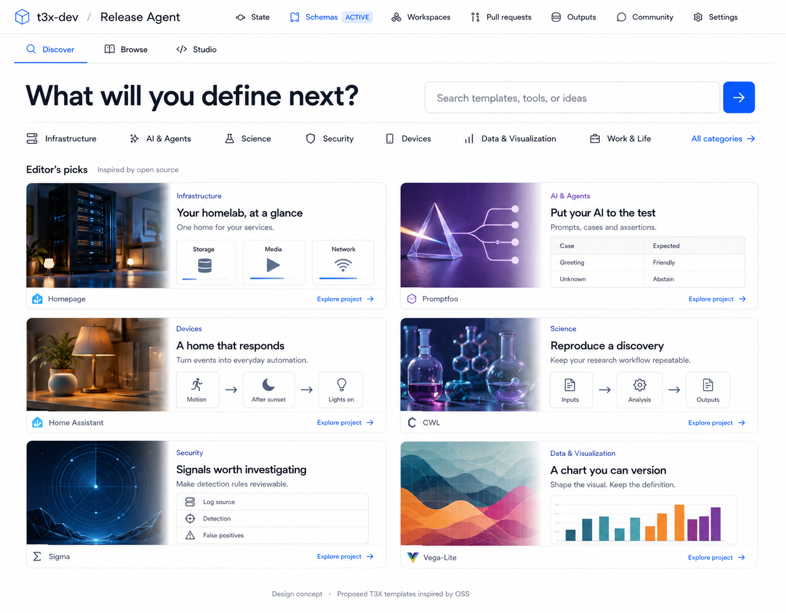
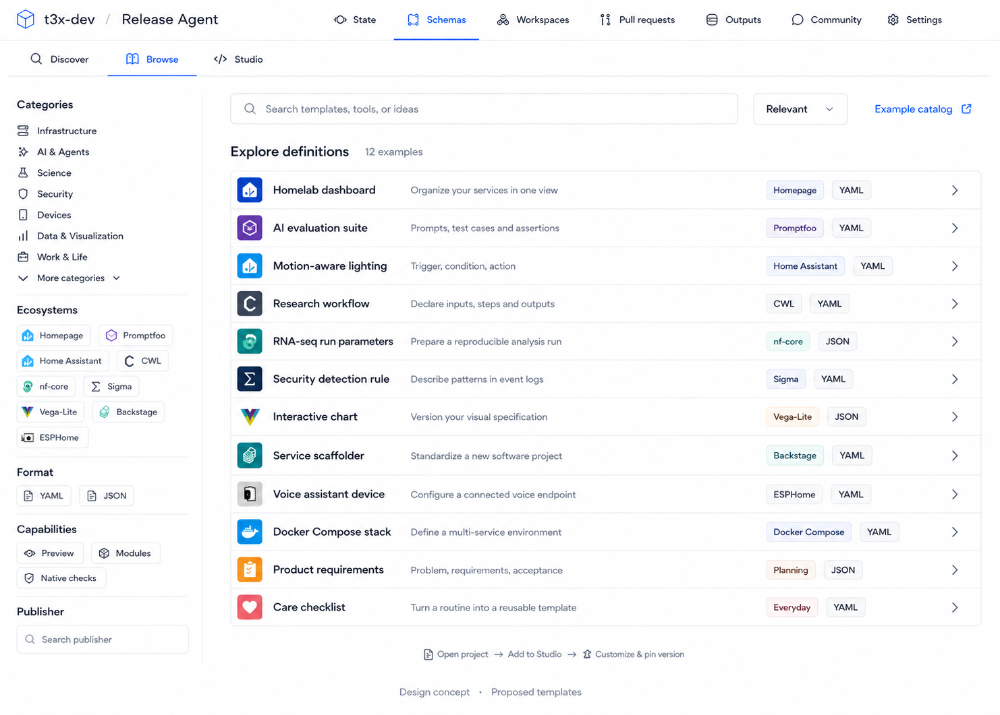
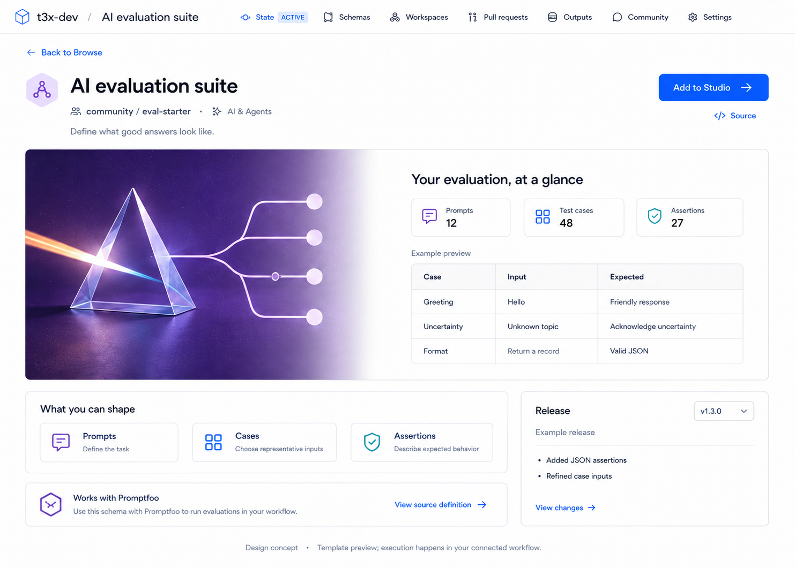
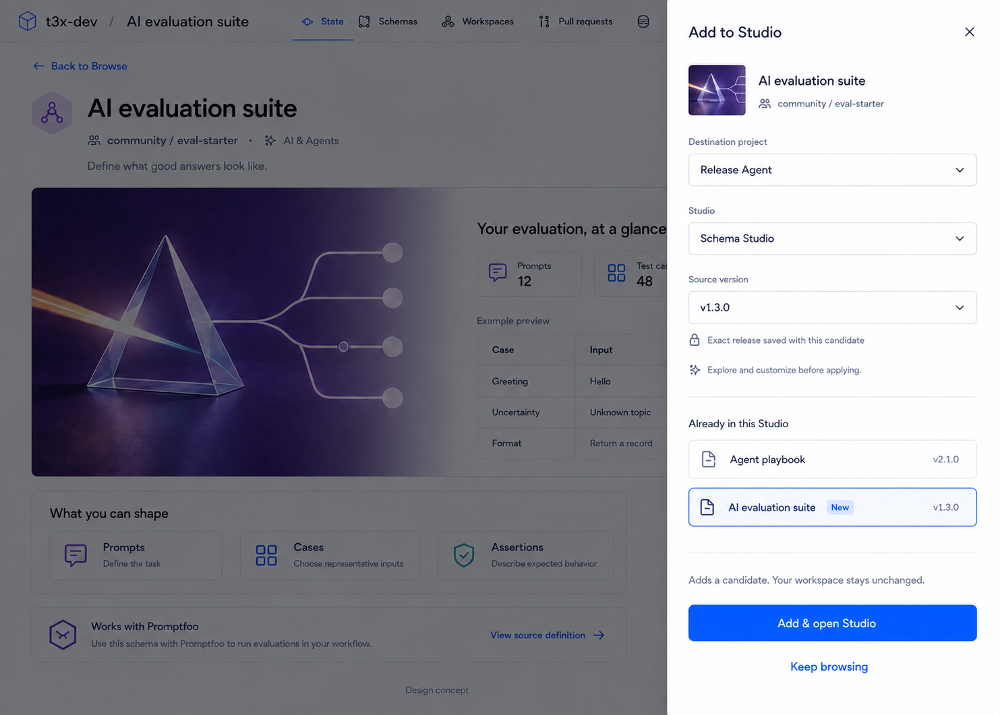
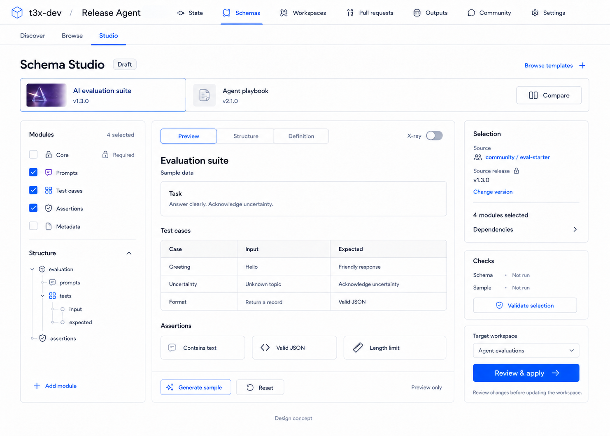
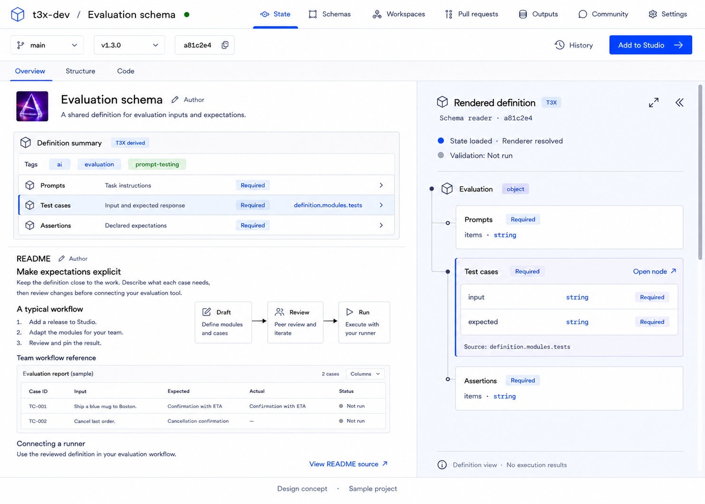

# State、Schema 与交付：实施计划

状态：计划，不是已实现能力。三个产品 Epic，19 个首批实施 issue。

## 基线与原则

- Core dev: `d13e92147fd8a5a5a38cbe0a1743fc869e342e65`。
- UI 参考分支：`codex/workspace-review-sidebar-polish@9618ef5661f422a6cc2da54d2d9ec5361c10a3b4`。相对 dev ahead 2 / behind 198；选择性整合，不覆盖 dev。
- 既有 #1316 拥有统一 renderer registry、精确版本及 fallback；#1148 拥有权威验证/修复；#1406、#1495/#1496 的 starter 工作复用。#1418 继续负责完整 archive/restore。无需第四个重复基础 Epic。
- 所有 state mutation 复用 application / Transition 权限、review、Decision、Commit 边界；不改变 protocol kernel/public package surface。
- YAML/JSON 是状态表示；导出、render、sample、运行结果各自有明确 provenance，不相互冒充。

## 最终产品约定（优先于图片）

### Leaf 与交付

先提供 exact State/Commit YAML/JSON 导出，再改接 Workspace delivery，移除 New Leaf 与 Outputs tab，保留旧 Leaf 只读 URL/历史/导出；最后有门槛地退役写入与专属代码。无直接删表，无新空 Ship tab。导出不需要先创建 Leaf。Render export 取决于真实能力。外部交付只在明确授权时执行，记录独立于 immutable commit。

### State

Overview / Structure / Code。保留现有 node table、inspector、history 和 YAML/JSON/Raw；旧 `view=render` 兼容。目录用户进入 Overview，开发者记忆偏好。

- 顶部作者区：小 avatar、title、description；不要求 Purpose/Includes，不设单独大 cover 空间。
- 中部 T3X 紧凑区：松散 tags + module/section summary。Tags 是作者/编辑元数据，不是引擎推导事实；summary 只来自声明。
- 下部作者 README：可选、自由段落、列表、图片、图表；空内容不留 placeholder。
- 右侧淡蓝 render pane：独立滚动、可 resize/expand/collapse，selected module 与 summary 联动并可打开实际 node。
- Sans 用于作者内容，Mono 仅机器路径/type/value；颜色搭配文字来源标识。
- resolution 分项表达 state、schema/ref、renderer；validation not run 不等于 pass，均不代表运行成功。
- 有模块声明才显示 modules；无声明显示 sections。不得凭 tags 推导组件/依赖或执行 renderer。
- presentation 与头像/README 资源的持久化合同由 B2 决定；图片中的 `presentation`、`definition.modules.tests` 是示意，不得作为强制业务 JSON wrapper。
- 所有视图绑定同一 immutable revision；已发布 presentation/resources 不被可变 catalog 文案覆盖。

### Schema

Discover（精选图文、search）→ Browse（紧凑筛选列表）→ schema 项目的 State Overview → Add to Studio（exact candidate）→ compare/modules/preview → review & pin → Workspace。

Discover 不承担 X-ray、compile 或 compare。Search/标签跳 Browse。Catalog 分类是宽松 tag collections + 官方 vocabulary + 自定义 tags，不是硬领域体系。广阔 OSS 示例是候选，不是已实现 compatibility。

添加 Studio 只保存候选，不能自动绑定或生成。V2 compiler/origin/hash 复用；不强制 core。必需 module 锁定选中。单体 schema 的 exclude 必须有声明边界或生成显式派生定义。latest 在解析时固定精确版本；升级显式审阅。应用后的 Schemas 展示当前绑定与诊断，修复复用 Workspace 权威链路。

## 参考图及纠偏

图片仅为布局参考，sample project/版本/状态不是生产数据，不是支持承诺。

1. Discover：视觉精选 + 搜索；分类改用 loose tag collection；移除图内 Outputs。
2. Browse：高密度列表和 filters；移除 Outputs。
3. 旧项目封面：**已被图 06 State Overview 替代**，只保留历史背景，不创建额外封面路由，不照抄假 counts/固定示例。
4. Add to Studio：抽屉交互复用，背景换成 State Overview；仅一个 Studio 时不要求冗余 selector。
5. Studio：交互方向参考；必需模块始终 included，去掉图中 empty Required checkbox；不强制 core；不替换已有 Workspace UI。
6. 最终 State：小 avatar + description / compact tags-summary / flexible README / right render；图内 Outputs 删除；tags 不应被总标签误标为 T3X derived。README 示例图属于作者内容，非实际执行。

### 01-discover.png

### 02-browse.png

### 03-project-showcase-superseded.png

### 04-add-to-studio.png

### 05-studio.png

### 06-state-overview.png

## PR 顺序与并行边界

第一波：A1 inventory、A2 direct export（A1 后），B1 branch reconciliation、B2 presentation contract；同时推进既有 #1316。

第二波：B3/B4 Overview、A3 export UI、A4 delivery config、C1 catalog。

第三波：A5 删除导航/保留只读、B5/B6；C2 Browse/Discover、C3/C4 handoff。

第四波：C5/C6 Studio、C7 complete journey；A6 在存量和调用方门槛满足后退役 writers。

每个 issue 描述首个 reviewable PR；大的退役/adapter issue 可拆多 PR，但不能将未执行的后续范围算作完成。先实现一条真实纵向链路，再扩充 ecosystem。

## 实施任务

### A1 [Backend] Inventory Leaf callers and define retirement / retention contract

归属：Backend / API / storage / CLI / MCP。依赖：无新增依赖。

先建立可执行的 Leaf retirement inventory：UI 入口、Workspace output targets、REST/OpenAPI、API client、CLI/MCP、runner、generation/learning/validation、billing attribution、history、output edits、archive 引用。提供只读、项目隔离的存量扫描工具和迁移映射；不读取或打印用户内容。

验收：

- [ ] 逐项区分 Leaf 产品对象和树的 leaf node、公开 alpha leaf package，后两者不能误删。
- [ ] 列出保留读取/导出、改接交付、退役写入三类端点和消费者，并标明 owner。
- [ ] 扫描报告只输出计数、引用完整性与版本分布；实际部署数据尚未扫描时明确 unresolved，不能宣称零使用。
- [ ] 定义弃用响应、兼容窗口、历史访问入口、回滚策略和数据保留标准；不删表、不改历史。

验证：Inventory regression test plus fixture databases containing old generations, edits, assertions and orphan references; tenant isolation; no content leakage.

代码参考：`packages/api/src/routes/leaves*.ts; packages/storage/src/queries/leaf*.ts; apps/cli/src/commands/leaves.ts; packages/mcp/src; apps/web/src/domain/workspaces/outputTargetLeaf.ts`

### A2 [Backend] Export exact committed State as YAML / JSON and renderer artifacts

归属：Backend / application / API。依赖：A1。

增加不依赖 Leaf 或模型调用的 commit-pinned 导出用例和类型化 API client。State/Commit 身份解析后读取精确对象；YAML/JSON 首先交付。渲染导出通过 #1316 的 renderer 能力声明，缺失格式显式不可用。

验收：

- [ ] 请求绑定 project、commit / State descriptor、schema binding；鉴权及 digest 检查通过后才导出。
- [ ] JSON 输出是 state value，不是 Leaf envelope；YAML 明确是受支持的 canonical serialization，不承诺保留原始注释/排版。
- [ ] HEAD 在请求期间变化不改变目标；不存在或无权限对象不能回退到 HEAD。
- [ ] 产物提供 MIME、文件名、字节 hash、来源 commit；渲染产物额外记录 renderer 版本、选项及资源 digest。
- [ ] 若支持子范围，显式标注为 partial export 并记录 selector；第一 PR 可只支持完整 State。
- [ ] 无 AI/key 可完成 YAML/JSON 导出；不声称所有 renderer 都支持 PDF/HTML。

验证：Round-trip semantic equality, deterministic bytes where promised, historical revision and ref-race tests, permission/digest failures, unsupported renderer format tests; API/application/client checks.

代码参考：`packages/application/src; packages/api/src/routes; packages/api-client/src; apps/web/src/infrastructure/export/core.ts (extract reusable utilities only)`

### A3 [Frontend] Add State / Commit Export and delivery-history entry points

归属：Frontend。依赖：A2。

在 State 与 commit 详情增加同一 Export / Deliver 小面板。第一 PR 完成精确版本 YAML/JSON 下载；受支持的 renderer 格式按能力展示。历史交付记录独立于 commit 内容。

验收：

- [ ] 面板显示确定的 revision 和导出格式；用户无需创建 Leaf。
- [ ] 新页与旧版 commit 详情复用组件，保留 branch/commit navigation intent。
- [ ] 下载、验证和部署状态不混称成功；无连接器时不显示可用部署能力。
- [ ] 只导出实际 state，不混入 README、秘密配置或完整历史；presentation/export scope 依据 B2 合同显式控制。
- [ ] 键盘、loading/error、无渲染能力、窄屏和重复点击有明确行为。

验证：Component plus browser journey: historical State -> export -> parse downloaded bytes -> compare state; read-only user permissions; missing renderer and errors.

代码参考：`apps/web/src/components/project/ProjectStateTab.tsx; apps/web/src/components/history; apps/web/src/infrastructure/export`

### A4 [Backend] Replace Workspace Leaf output targets with version-bound delivery configuration

归属：Backend / application / adapters。依赖：A1, A2。

将 Workspace output target 的生产路径从 createLeaf 改为 exact committed artifact + delivery adapter。复用已存在的 runner/export 边界；第一 PR 提供 download adapter 和可测试的 adapter 合同，不承诺新增所有 CI/CD 连接器。

验收：

- [ ] 保存配置不执行外部副作用；实际交付有明确授权、目标和 exact commit。
- [ ] 历史 target 映射可审计；无法映射的生成型 target 标为 legacy，不静默当成 deploy。
- [ ] 执行记录附着 commit，包含 artifact digest、adapter/version、target、attempt、状态；不改写 CommitV2。
- [ ] 可重试执行具备 idempotency、失败结果和必要的未知状态；不得把 HTTP 接收当成部署完成。
- [ ] 保留权限隔离；token/secret 不写入公开 state、artifact 或日志。

验证：Target migration fixtures; fake adapter success/failure/timeout/retry tests; authorization and duplicate-delivery checks; no automatic external execution.

代码参考：`apps/web/src/domain/workspaces/outputTargetLeaf.ts; packages/application/src/workspace; packages/api/src/routes/workspaces*; packages/api-client/src`

### A5 [Frontend] Remove Outputs / New Leaf and preserve legacy read-only access

归属：Frontend / routing。依赖：A3, A4。

删除 Outputs 主导航和 New Leaf / Generate 主入口；Workspace output 配置接 A4。旧 Leaf 详情保留只读生成内容、历史、约束证据与导出；从 commit legacy artifacts 或旧链接访问，不另建空 Ship tab。

验收：

- [ ] 主导航、计数、入门教程、空态、Canvas/Workspace 入口不再创建新 Leaf。
- [ ] 旧 URL 仍可访问精确历史 Leaf 或明确重定向到 legacy 只读视图；不误指向当前 HEAD。
- [ ] 旧文案输出、history 和用户 edits 保留；禁用生成/改写/learn 等写操作不只依赖隐藏按钮，需后端 A6 阶段限制。
- [ ] Outputs query links 有兼容路由；legacy reader 与 export 权限一致。
- [ ] 不存在 Outputs tab 的新 Overview、Discover、Browse、Studio 都可完整导航。

验证：Routing and browser regressions for bookmarked links, empty legacy data, old exports and output-target handoff; accessibility; no public create affordance.

代码参考：`apps/web/src/components/project/ProjectTabs.tsx; ProjectOutputsTab.tsx; ProjectLeafManager.tsx; apps/web/src/app/project/[projectId]/leaf/[leafId]/page.tsx; components/workspaces/OutputTargetsTab.tsx`

### A6 [Backend] Retire Leaf generation writers and qualify legacy compatibility

归属：Backend / CLI / MCP / QA。依赖：A1, A5。

根据 inventory 逐步退役 Leaf create/generate/edit/learn 等专属写路径、类型和无调用实现，更新 CLI/MCP/API-client 契约及迁移文档。只读历史和导出继续受支持；每批删除单独 PR。

验收：

- [ ] A1 所有调用方已迁移或有明确弃用响应与迁移指引；不能仅删前端。
- [ ] 存量扫描/fixture 保留验证完成，历史 output、edits、assertions、generation attribution 可查询；数据库破坏性清理另议。
- [ ] 保留共享 inference billing、runner、validator、Transition、YOps/YSchema、树 leaf node 与公共 package surface。
- [ ] 反向学习/生成专属代码不存在残留主动调用；API contract 和 CLI/MCP tests 更新。
- [ ] 受影响测试与 build 通过，auth/legacy export/新导出纵向流程有证据；无未经验证的全量清理。

验证：Contract retirement tests, historical read/export regression, CLI/MCP errors, callsite inventory closure and retained metering tests; pnpm check/build and impacted suites.

代码参考：`packages/api/src/ops/leaf-gen.ts; packages/api/src/routes/leaves*.ts; packages/core/src/leaf; packages/storage/src/queries/leaf*; apps/cli; packages/mcp`

### B1 [Frontend] Reconcile JJY State UI branch onto dev without replacing its node views

归属：Frontend / integration。依赖：无新增依赖。

以 dev 为 implementation base，审查 codex/workspace-review-sidebar-polish@9618ef5 的两个分支提交，按 hunks 复用 State typography、relations rail、node table、inspector、Code。该分支已落后 dev 198 commits（计划基线），不可整分支覆盖。

验收：

- [ ] 记录 merge-base 与当前 diff；分别列出复用、更改、已被 dev 替代的 hunks。
- [ ] 保留 Structure 的紧凑表格、选中节点 inspector、history、diff/source links；Code 保留 YAML/JSON/Raw。
- [ ] 不回滚 dev 的 Transition/权限/Workspace writer 退役；聊天改动不混入本 PR，除非确为依赖。
- [ ] 遵循该分支 DESIGN.md 与 STATE_WORKBENCH_TYPOGRAPHY.md；在真实浏览器保存各 view 的基线截图。

验证：ProjectStateTab, node history and StateCodeView tests plus real browser smoke, pnpm check and web build; review diff against current dev.

代码参考：`apps/web/src/components/project/ProjectStateTab.tsx; StateCodeView.tsx; ProjectShell.tsx; ProjectTabs.tsx; apps/web/STATE_WORKBENCH_TYPOGRAPHY.md`

### B2 [Backend] Version project description, README, avatar and loose tags as presentation resources

归属：Backend / storage / API。依赖：无新增依赖。

确定共享 presentation/resource 合同：作者填写 description，README 与小 avatar 可选；README 支持作者图片/图表。不要强制把 presentation 包进任意用户 JSON 根节点；根据现有 schema artifact/resource 模型选择可版本化的 sidecar 或声明命名空间。

验收：

- [ ] Schema definition 本身继续是 T3X 可开发的通用结构化 state；展示资源与精确 release/revision 绑定且可回溯。
- [ ] 发布版本使用不可变或 content-addressed README/图片；可变 catalog 元信息不能改写历史发布版本。
- [ ] 用户不必填 Purpose/Includes，也不必上传封面；缺省内容不占空白。
- [ ] 区分作者选取的 tags 与派生结构；官方 vocabulary/alias 和自定义 tag 均可用，tag 不成为校验/renderer authority。
- [ ] 资源上传/引用鉴权、大小/MIME、可访问性文字、相对链接和删除后历史可读性有合同。
- [ ] 导出业务配置时不意外包含 presentation sidecar；与 A2 对齐。

验证：Version switching/resource hash tests, no-README/avatar fixtures, JSON root preservation, tenant/resource permission and malicious markup/link fixtures.

代码参考：`packages/storage/src; packages/api/src/routes schema artifacts/projects; packages/api-client/src; existing schema version resources`

### B3 [Backend] Project exact-state summaries and scoped renderer resolution status

归属：Backend / application / YSchema。依赖：B2。

消费 #1316 的 registry / render context / origin maps，提供共享 Overview read model：已选 state、声明模块或顶层 sections、来源路径、渲染模型和分项 resolution status。不实现第二 renderer registry。

验收：

- [ ] 同一 revision 的 summary/render/Structure/Code 一致；HEAD 前进不替换已选版本。
- [ ] 仅已有 module 边界才叫模块；普通 JSON 显示 sections，不凭字段名或标签发明模块、依赖和流程箭头。
- [ ] 说明文字来自定义中的显式 metadata；无说明就不生成，无强制 AI。
- [ ] state loaded、schema/ref resolution、renderer selected/fallback 与 validation verdict 分开；未知/未运行不能显示 passed。
- [ ] renderer unavailable 使用 #1316 generic fallback；原始 state 不丢失；digest 不匹配显式失败。
- [ ] summary path ↔ render node 来源映射稳定；schema definition 的渲染与实例内容预览明确区分。

验证：Determinism, unknown schema, undeclared modules, dangling refs, tag-independent selection, stale ref and digest mismatch tests; reuse #1316 fixtures.

代码参考：`packages/yschema/src/composition-v2; packages/application/src; apps/web/src/domain/project/stateViewModel.ts; #1316 registry contract`

### B4 [Frontend] Build compact State Overview with author content and T3X render sidebar

归属：Frontend。依赖：B1, B2, B3。

按图 06 实现 Overview：左侧作者小 avatar/title/description；中段 T3X 格式的 loose tags 与 definition summary；下面灵活 README；右侧淡蓝可独立滚动的真实 render pane。

验收：

- [ ] 用户区白底 Sans；T3X summary/render 淡蓝，机器路径/type Mono，并有文字来源标记，不只靠颜色。
- [ ] 无单独大封面、Purpose/Includes、必填示例；大图只在作者 README 中按内容流展示。
- [ ] tags 虽在 T3X 区显示仍标明 metadata，不归为 derived facts；摘要只显示 B3 的事实。
- [ ] 选中 summary 项滚动并高亮右侧对应节点，Open node 可到现有 Structure。
- [ ] 右栏 sticky、resize/expand/collapse、独立滚动；窄屏单栏/抽屉不形成无法滚动的嵌套区域。
- [ ] resolution 与 validation 明确分开；无假数据/静态生成图充当实际 renderer。

验证：Browser desktop/narrow/keyboard/long README/long renderer fixtures; selection mapping tests; visual review against 06 with real data; optional resources absent no empty blocks.

代码参考：`apps/web/src/components/project/ProjectStateTab.tsx; StateGenericReader.tsx; existing rich readers and StatePaneResizeHandle`

### B5 [Frontend] Preserve revision-aware Overview / Structure / Code navigation and author editing

归属：Frontend / API integration。依赖：B2, B4。

将 Render 用户标签收敛为 Overview，保持旧 view=render 深链接兼容；目录进入 Overview，开发者记忆 last-used view。作者从受治理的现有编辑路径修改描述、README、avatar 和标签。

验收：

- [ ] 所有 view 共享 exact project/ref/commit，切换不漂移；旧 render URL 与历史链接可用。
- [ ] Structure/Code 可展开相同 README，不替换 node inspector，不复制另一份可变 README。
- [ ] metadata/content 编辑经已有 application mutation 边界，已发布资源更新产生新版本，不在只读 commit 视图直接改历史。
- [ ] 浏览返回路径、选中节点、权限状态保留；无未授权 edit 控件。
- [ ] Add to Studio 与 Export 按真实 capability 显示，共用 scope，不需要 Outputs tab。

验证：Deep link/ref switching/back navigation/persistence tests and author/read-only browser journeys; invalid published edits rejected.

代码参考：`apps/web/src/components/project/ProjectStateTab.tsx; project routing; project metadata forms; API-client`

### B6 [QA] Qualify State overview fidelity, resource safety and export consistency

归属：QA / frontend / backend。依赖：B4, B5, A3。

完成新 Overview 与现有 Structure/Code 的真实状态纵向验收，固定 fixture 和浏览器截图。此 issue 是 release gate，不另造重复 unit test 集。

验收：

- [ ] 普通 JSON、yschema、已支持 rich reader、未知 renderer、空/长 README、无头像、长列表 fixture 覆盖。
- [ ] 作者 HTML/Markdown/图片链接安全处理，键盘焦点/contrast/scroll/resize 可用。
- [ ] selected revision 的 view values 与 A2 导出的状态语义一致；资源缺失有可理解的局部错误。
- [ ] 无渲染时 Structure/Code 可用；旧链接/权限/节点 history 不回归。
- [ ] 列出本次实际执行的测试和截图；样例图不当成测试证据。

验证：Run impacted unit/integration suites once, web build and end-to-end browser checks with fixtures; retain failures and fixes, no unexplained timeout retries.

代码参考：`apps/web/src/__tests__/components/project; apps/web/e2e/smoke/state-page.spec.ts; API resource and export tests`

### C1 [Backend] Publish permission-aware schema catalog and editorial tag collections

归属：Backend / catalog / application。依赖：B2。

复用现有 schema artifact/version registry 与 #1406 manifest，增加 Discover collections 和 Browse search/filter 投影。分类是松散标签与官方精选集合，不做硬编码领域层级或能力判断。

验收：

- [ ] 记录 identity、immutable release/hash、owner/license、作者描述/avatar、可选 editorial media、明确的 renderer/check capabilities。
- [ ] Discover editorial 文案/图片与结构预览区分；未实现的 OSS adapter 不标兼容或可执行。
- [ ] Browse 支持 query/tags/ecosystem/format/publisher/capability、pagination 和稳定排序；返回当前调用方可见的发布内容。
- [ ] private state、README、资源和未发布 revision 不因 search 或缩略图泄漏。
- [ ] 平台 curated tags/aliases 与自定义 tags 兼容；tag 改动不改变 renderer/validation。
- [ ] definition shape 与 starter instance 分开；复用 #1406/#1495/#1496 已交付切片。

验证：Search/filter/pagination/permissions tests, capability vs tag fixtures, historical releases and catalog indexing freshness.

代码参考：`existing schema artifact registry routes/storage; packages/api-client; #1406 starter manifest`

### C2 [Frontend] Build visual Discover and compact faceted Browse

归属：Frontend。依赖：C1。

Discover 采用编辑精选的大图+简短介绍+真实可用预览；搜索和标签点击进入独立 Browse。Browse 是高密度列表和侧栏 filters，条目进入 schema 项目 State Overview。

验收：

- [ ] Discover 无 module/X-ray/compare 操作；搜索 query/filter intent 写入 Browse URL。
- [ ] Browse 紧凑行包含名称、一句说明、少量有意义 tags，不复用大广告卡。
- [ ] 返回 Browse 保留 query/filter/分页/滚动位置；empty/loading/error/权限状态完整。
- [ ] 图片来自作者或明确 editorial 资源，无每次浏览强制 AI 生成；无伪造 stars/downloads/support badges。
- [ ] 旧图的 Outputs tab 移除；第三张旧独立封面页不作为新路由。

验证：Browser navigation/keyboard/mobile/image fallback/long titles/search URL round-trip; component tests on real catalog fixtures.

代码参考：`apps/web/src/components/schema; ProjectSchemasTab; registry list routes; #1406 gallery integration`

### C3 [Backend] Save Studio candidates with exact cross-project schema provenance

归属：Backend / application / API。依赖：C1。

增加 Add to Studio candidate 合同。保存目标 project/studio、来源 project/artifact/version/hash 和可重放依赖引用；加入候选不绑定 Workspace、不启动抽取、不调用 AI。

验收：

- [ ] 分别检查来源读权限、目标写权限与资源许可；跨项目 import 遵循明确授权。
- [ ] latest 在添加时解析为 exact immutable version/hash；双击与网络重试不重复 candidate。
- [ ] candidate 与 applied binding 为不同状态；移除 candidate 不删除来源 artifact。
- [ ] 定义 source 撤回/删除/权限变化后 pinned resources 的保留与访问策略；缺失明确失败，不换最新。
- [ ] 在当前 registry/project-scoped resolver 上扩展，不靠 Web 拼接 private 数据。

验证：Cross-project authorization, idempotency, version races, missing source, candidate delete and zero-workspace-mutation tests.

代码参考：`packages/application/src; schema registry resolver; packages/api/src/routes/schema*; packages/storage; packages/api-client`

### C4 [Frontend] Add schema project-to-Studio handoff drawer

归属：Frontend。依赖：B5, C3。

在 schema 项目的 State Overview 提供 Add to Studio 抽屉，确认目标和 exact release；Add & open Studio 或添加后继续浏览。

验收：

- [ ] 抽屉来自真实 source revision，不重置到最新；展示来源/目标/版本和 candidate 性质。
- [ ] 仅一个 studio 时省略冗余 selector；目的地权限或容量错误有明确反馈。
- [ ] 取消或加入 candidate 都不修改 workspace schema binding，不启动 generation/extraction。
- [ ] 已存在候选可打开，添加重试不会重复；返回 Browse intent 保留。
- [ ] 采用图 04 handoff 交互，但背景用最终 State Overview，非旧图 03。

验证：Drawer keyboard/focus tests; signed-out/unauthorized/duplicate/version-change browser cases; API candidate assertions.

代码参考：`apps/web/src/components/project; schema studio components and route state`

### C5 [Backend] Compose, compare and explicitly apply pinned Studio schema selections

归属：Backend / YSchema / application。依赖：C3, B3。

复用 Composition V2 compiler、origin maps、renderPlan、hashes 和 review/Decision/Commit 边界。支持 candidate selections、declared modules、可重放 compile/compare 和显式 binding 更新；不能通过隐藏字段伪造模块化。

验收：

- [ ] 模块 include/exclude 遵循声明依赖、必需关系与冲突；V2 不强制固定 core/module 二分法。
- [ ] 单体 schema 无声明边界时只允许整体使用或显式派生新定义；可见性隐藏不等于 schema 删除。
- [ ] compare 区分 schema 差异、模块选择、数据迁移和 preview；同输入编译 hash 稳定。
- [ ] Apply 绑定 exact schema/composition hash、target revision 和 review preconditions；过期状态要求重新审阅，不覆盖。
- [ ] 上游新版本仅通知/可比较，升级和迁移单独显式接受；不会浮动 latest。
- [ ] 复用 #1148 的 authoritative validation/fix path；内容修复与规则变更分开，binding 变化使旧 review 失效。
- [ ] 可选 AI sample 只能产生标识清楚的候选数据，经 validator 后交给同一 renderer，失败不冒充有效 preview。

验证：Dependency/conflict/monolith/cross-project compile tests; exact version/TOCTOU/stale review/upgrade tests; apply leaves other workspaces unchanged.

代码参考：`packages/yschema/src/composition-v2; resolveWorkspaceYSchema; application review/binding; schema composition routes; #1148`

### C6 [Frontend] Build Studio compare / modules / preview and active-schema experience

归属：Frontend。依赖：C4, C5。

实现 Studio 候选、compare、module selection、preview/definition、版本与来源、checks、Review & apply。应用后 Schemas 默认展示当前绑定和诊断，Discover/Browse/Studio 保持可达。

验收：

- [ ] Required 模块永远 included/locked，不能出现图中 required core 空 checkbox；不强制所有定义有 core。
- [ ] 比较和结构 detail 按需展开，不将所有 panel 同时堆满；sample preview 与实际 state 清楚区分。
- [ ] 未运行 checks 显示 Not run；兼容性来自后端不是 tags；apply 展示 target 与 exact changes。
- [ ] 从 schema 诊断进入 Workspace 修复，再返回显示同一 revision 的权威结果；不复制第二套待修复状态。
- [ ] 已有绑定显示固定版本、变更记录与上游更新提示；升级需 review，不静默追随。
- [ ] 保留现有优秀 Workspace UI，改动仅限 handoff/binding/diagnostic integration。

验证：Browser candidate -> compare -> module change -> validate -> review/apply -> active binding -> upgrade/repair; cancellation/stale/failed checks coverage.

代码参考：`ProjectSchemasTab; SchemaModuleRegistry; SchemaArtifactDetail; workspace schema binding/diagnostic components`

### C7 [QA] Qualify the no-AI schema journey with licensed cross-domain fixtures

归属：QA / catalog / integration。依赖：C2, C6, B6, A5。

以真实可执行的首批 fixture 跑通 Discover 到 commit export。广阔 OSS 视觉是愿景而非既有支持：首批选现有 PRD、一个 generic definition 和一个已确认可用 config fixture；其他按 capability 标注。

验收：

- [ ] 无 provider key 可完成 Discover/Browse/State/candidate/compile/preview/apply/Workspace review/commit/export。
- [ ] 每个 fixture 带确切来源、license/attribution、schema version、render fallback 与已验证的 check/export 能力。
- [ ] 图 01 的 Promptfoo/CWL/Sigma 等不自动成为已实现 adapter 承诺；缺 renderer 使用 generic，不伪造结果。
- [ ] 跨项目权限、旧版本选择、上游升级、失败校验与历史 links 覆盖。
- [ ] 最后 nav 无 Outputs；旧 Leaf 历史可读；真实 State 节点/code/export 一致。
- [ ] Core QA 与 Cloud overlay/sync 兼容性有影响清单；具体 Cloud 改动另在 Cloud 跟踪，不复制 Core 实现。

验证：Record complete browser/API evidence and downloaded artifact checks; run affected build/test/standards checks; one accepted vertical slice before broad catalog expansion.

代码参考：`apps/web/e2e; schema starter fixtures; existing #1406 and PRs #1495/#1496; Core->Cloud sync ownership`

