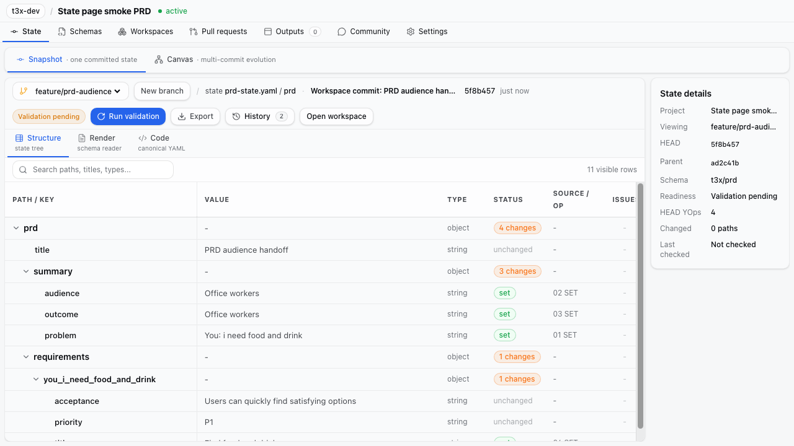
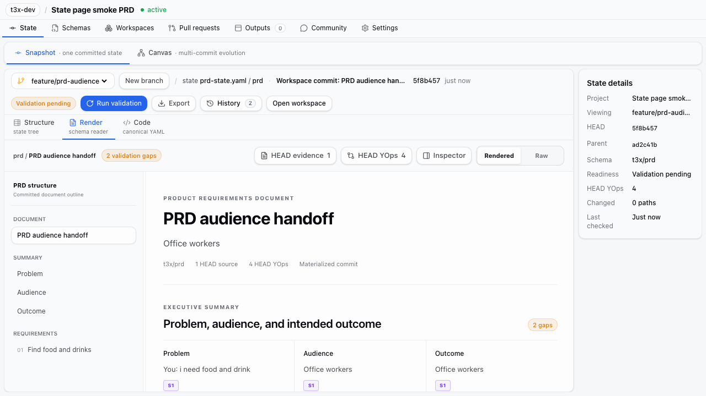
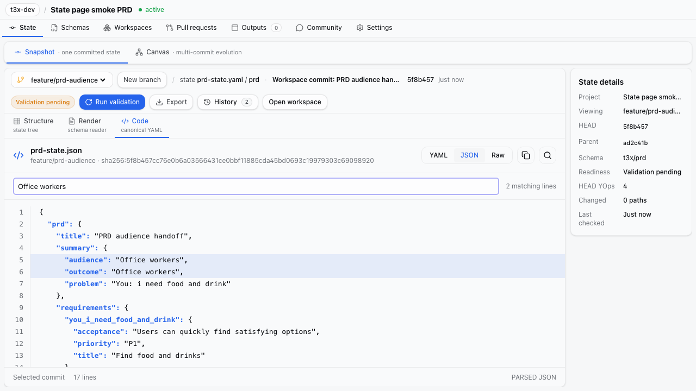
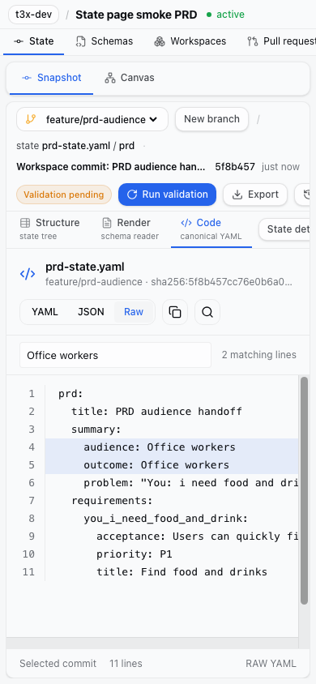

# State UI reconciliation — first slice

Issue #1508, Epic #1500. This is a selective integration, not a branch merge.

## Inspected revisions

- Implementation baseline: `origin/dev` at `4ff87324f614609496a10a85d6c81b2aa35461ee`.
- Source branch: `codex/workspace-review-sidebar-polish` at `9618ef56`.
- Merge base: `ae1aa7440226cd90f94a1a6028e846846d7e9753`.
- Source-only commits: `f83f35e6` (workspace review UI), `9618ef56` (Compose).
- At inspection, dev had 217 commits absent from the source branch. The source
  diff from the merge base touched 139 files, including application/storage/API
  contracts. It is not safe to replace current dev with that branch.

## Hunk disposition

| Surface | Decision in this PR |
| --- | --- |
| `StateCodeView.tsx` | Adapt its filename/branch header, YAML/JSON/Raw controls, search, copy, line gutter, and 13px/22px code density into a standalone read-only component. |
| `STATE_WORKBENCH_TYPOGRAPHY.md` | Apply the source's 36px group / 34px leaf rows, 16px indentation, 13px readable values, 14px leading groups, and 12px auxiliary labels locally. Do not change global typography. |
| Code review/diff callbacks | Defer; importing these pulls in the source branch's absent `stateYamlReview` and review components. Keep current dev's diff and history routes. |
| Code validation footer | Change: show selected-commit provenance. Parsing or rendering code is not a successful schema validation. |
| Code conversion failure | Change: explicit unavailable state; keep YAML/Raw accessible. Never copy a synthetic JSON error object as project content. |
| Code mobile controls | Change: keep all format buttons accessible on narrow screens rather than hiding the selector. |
| Structure tree | Keep dev's data, search, expansion and source-operation projection. Apply only the documented readability hierarchy. |
| Selected-node inspector and relations rail | Remain open under #1508. Need a separate adapter to current dev's node history and Transition contracts, rather than copying old review data models. |
| ProjectShell / ProjectTabs | Keep current dev routing, permissions and navigation. No global shell replacement. |
| Workspace / Compose / API / storage changes | Excluded. Their old lifecycle and write paths are superseded by dev's Transition work and must not be reintroduced by a visual integration. |
| Render readers | Preserve current readers and exact selected snapshot. Overview's render rail and generic fallback remain #1510/#1511. |

The source branch's `apps/web/DESIGN.md` and
`apps/web/STATE_WORKBENCH_TYPOGRAPHY.md` were reviewed. Their readable density and
bounded font hierarchy guide this slice; Compose-specific rules do not require
porting Compose code.

## Verification

- StateCodeView tests cover exact YAML/Raw copy, JSON preserving date strings,
  explicit revision updates, search, malformed source, clipboard denial and
  escaped source markup.
- Existing ProjectStateTab tests preserve pinned-snapshot behavior and
  Structure/Render/Code/Canvas navigation.
- Production browser smoke captures Structure, existing Render, desktop Code,
  and mobile Raw. The flow exercises branch controls, validation, source search,
  Canvas and Workspace navigation.

This PR does not close #1508. The inspector/relations work remains explicit.
Author content resources (#1509) must be version-bound before Overview can show
README/avatar alongside the selected immutable State. No optional author content
is synthesized by this change.

## Browser captures

