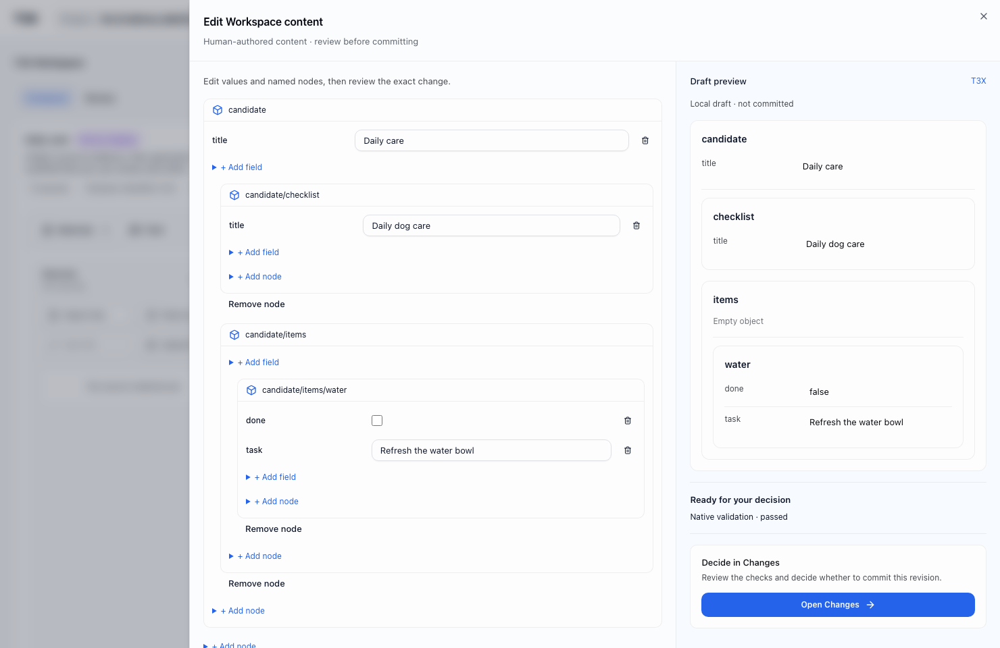
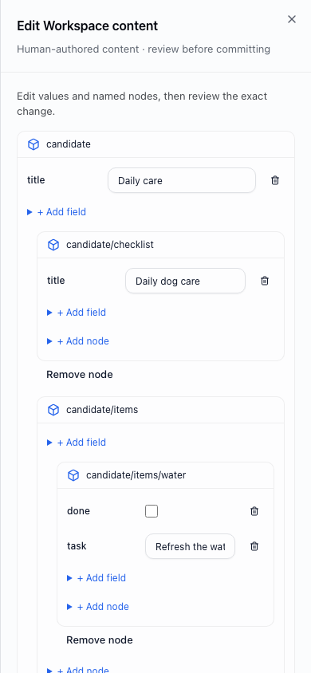

# Browser authoring qualification

Real production WebUI, API and disposable embedded PostgreSQL; no model keys or mocked responses. The Playwright journey creates only the initial empty Workspace through its fixture API. Definition adoption, node/field authoring, native failed review, correction, fresh review, decision and Commit download all happen through the browser. The downloaded JSON equals the exact Commit export bytes from the API. A separate adversarial API override still proves that failed validation cannot be relabeled Ready.

Desktop: 1480 × 960. Mobile: 390 × 844.

Actual-browser iterations found and fixed: empty YOps rejected by the validation endpoint; draft refresh overwriting local edits after review; duplicate review actions; repetitive add forms; mobile split scrolling; inherited link color reducing action contrast. Every edit invalidates the prior review. JSON field syntax uses native form validity before review. Local draft edits are not persisted merely by typing; closing the editor discards them. Existing Changes remains the sole decision surface.

Validation: `node tools/full-e2e.mjs -- e2e/smoke/schema-delivery-no-ai.spec.ts` passed. WorkspaceWorkbench and YOpsDraftTransition: 33 tests passed. `pnpm check` passed with two pre-existing next/image warnings.

References: the approved State Overview's author/derived split and independent desktop renderer, applied to Workspace authoring rather than pretending this is the same screen. [JSON Forms validation](https://jsonforms.io/docs/validation/) informs explicit validation feedback; native T3X statements remain authoritative.
