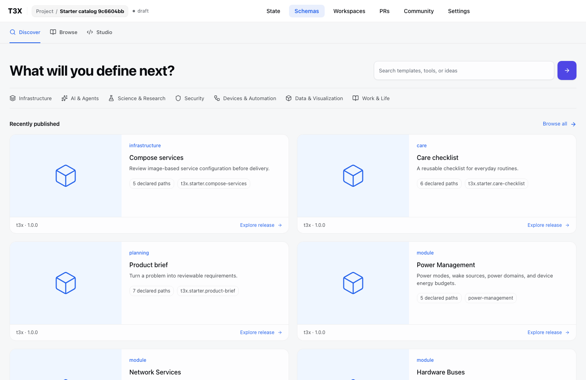
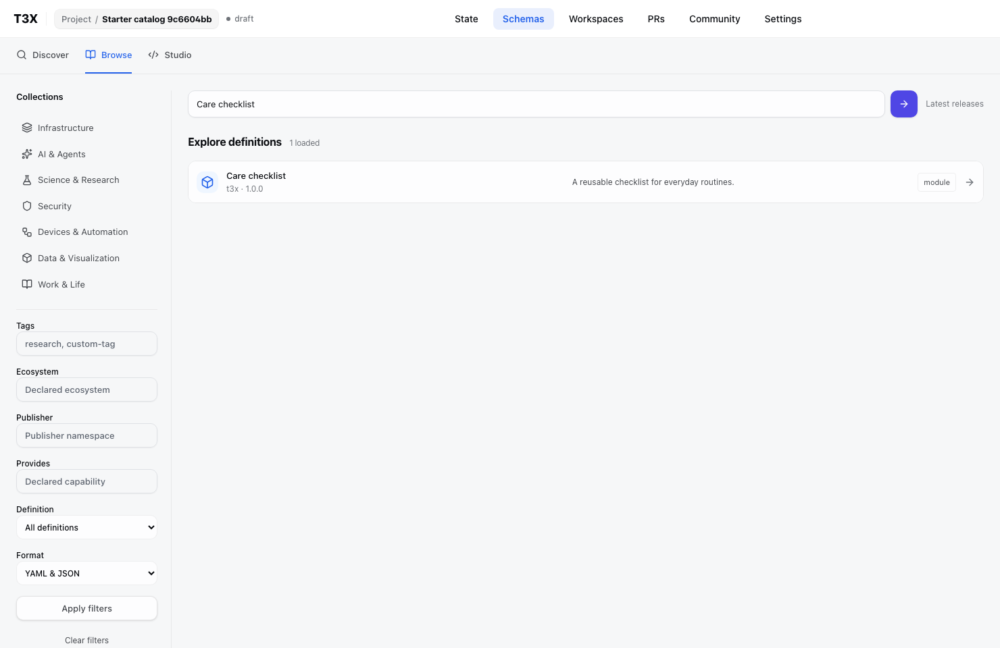
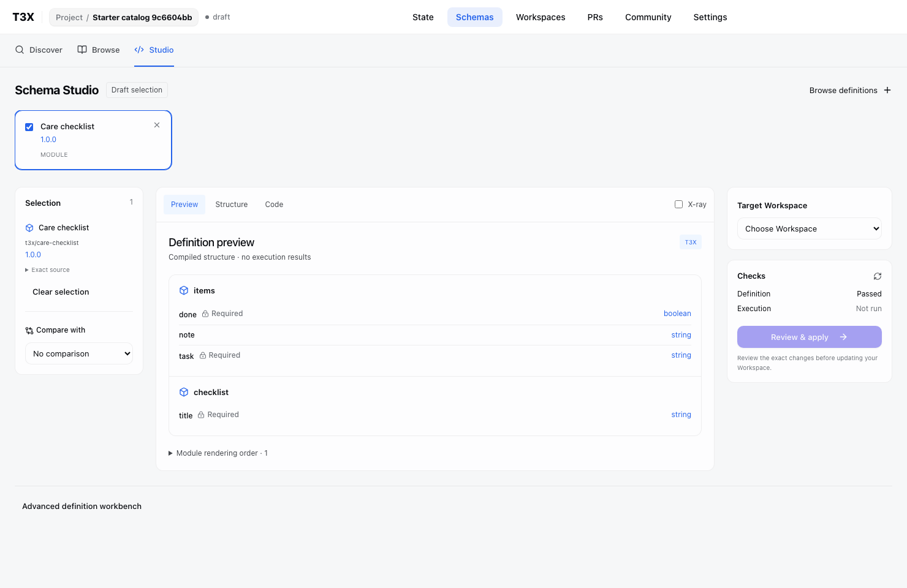

# Original ecosystem starters

T3X-authored Apache-2.0 modules: Product brief, Care checklist, Compose services. Open V2 composition; generic registry family with domain/ecosystem tags. No additional closed family enum, AI generation or deployment capability. Exact source hashes include README and sample.

Native compiler + sample validation and real catalog tests: 16 passed. Real browser Discover → search/Browse → release detail → Add to Studio: passed. Screenshots inspected. Fixed the release drawer remaining over Studio after successful addition.

Compose sample additionally passed the official Compose JSON Schema at [fee041b381ffd4aad263410980bdce0cdf4beb7d](https://github.com/compose-spec/compose-spec/blob/fee041b381ffd4aad263410980bdce0cdf4beb7d/schema/compose-spec.json), using Ajv 2020. No Docker CLI or deployment executed. This is an image-based subset; T3X slot validation is not complete Compose validation. [Service reference](https://docs.docker.com/reference/compose-file/services/).

README/sample are part of the source manifest, not indexed into discovery payloads. Existing catalog fallback artwork is used when authors have not supplied a project cover; no synthetic publisher claims or AI illustrations are added.

