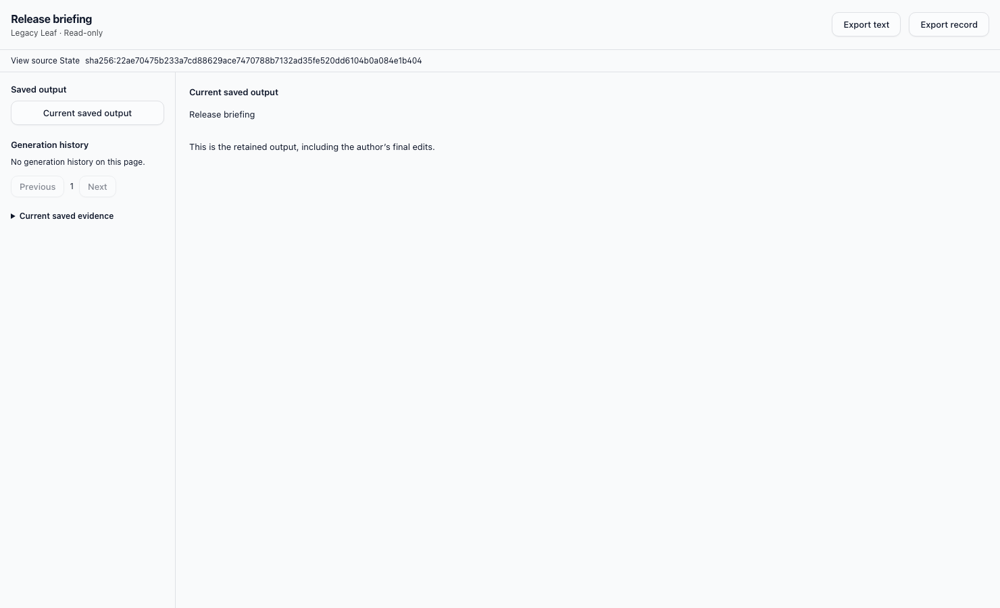
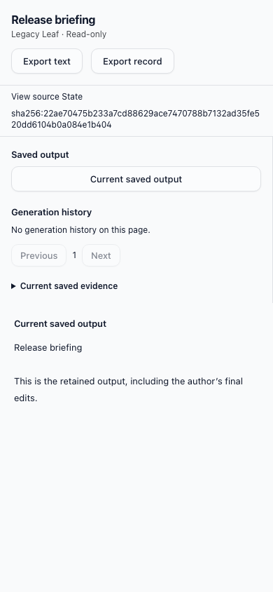

# Leaf writer retirement verification

Real local browser/API/PostgreSQL run, without AI providers. Historical fixture data is seeded directly into the disposable database because production creation is retired.

- Historical Leaf reader retains the saved author-edited output and source revision.
- A write attempt returns HTTP 410 and does not replace the saved output.
- Text/record export remains available; State export verifies exact source revision.
- Desktop and mobile screenshots inspected; no creation or mutation controls.
- This fixture has no generation history; API authorization regression separately covers historical readers.

