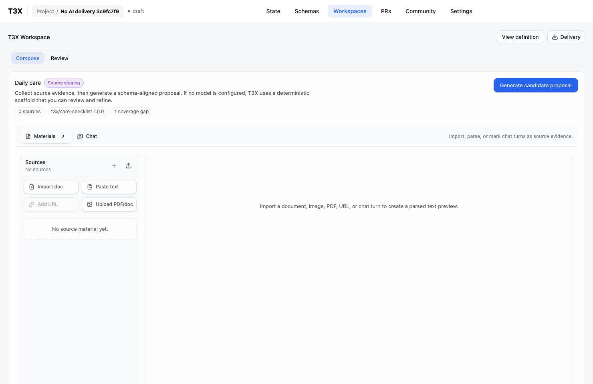
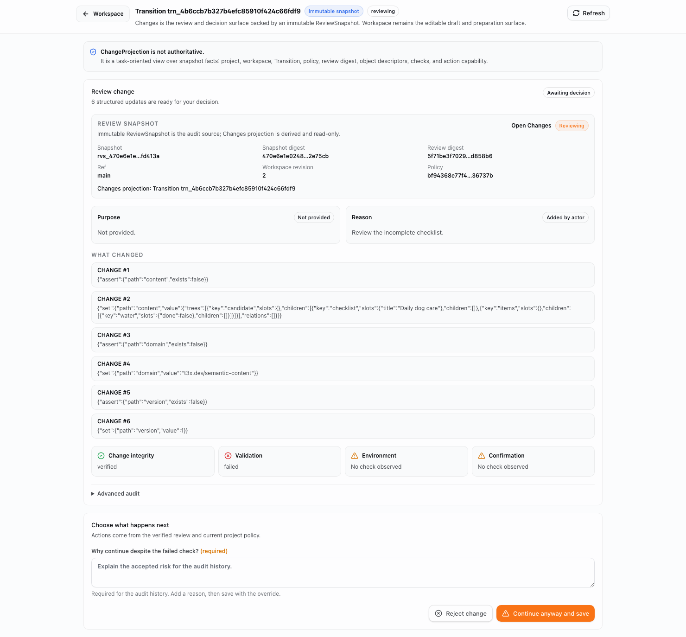
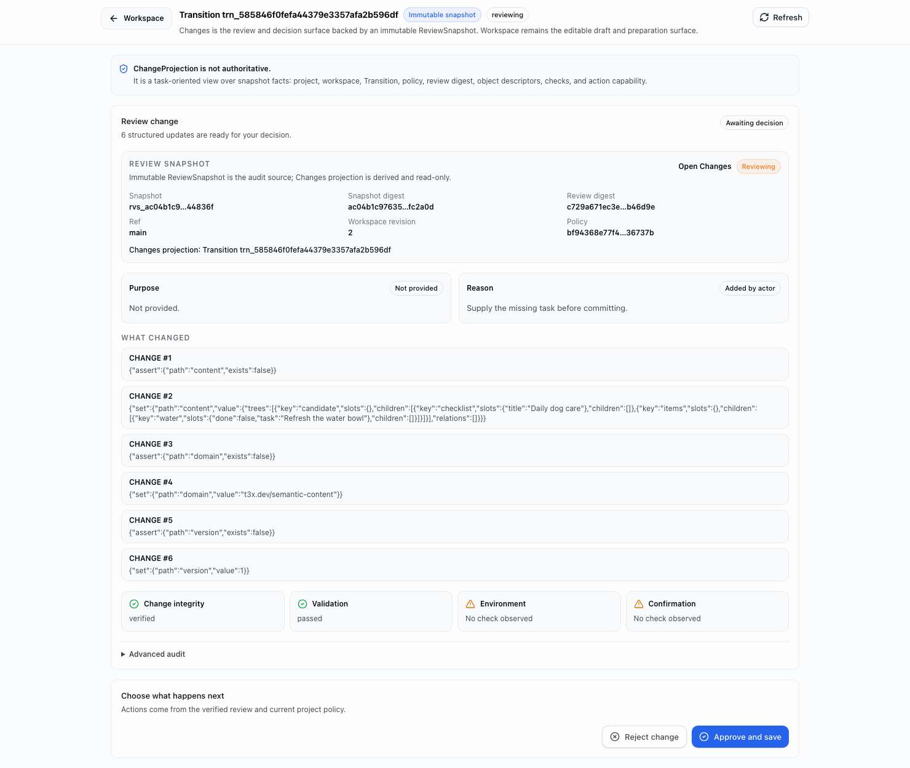
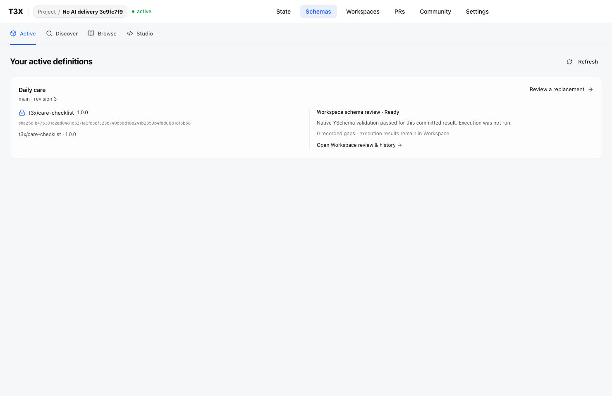
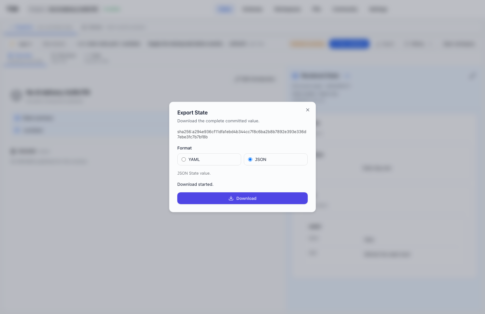

# No-AI delivery qualification

Real production Web/API, native YSchema/replay and disposable PostgreSQL. The full runner clears external model credentials. No API response mocks, inserted Commits, manufactured validation results or overrides in the successful journey.

1. UI Discover search → Browse → exact Care checklist release → Add to Studio.
2. UI selects Workspace, reviews and applies the exact definition.
3. Human-authored structured content is submitted through the real Workspace review API (not typed into a browser editor). Missing task prevents acceptance in the immutable review UI.
4. Submit the repaired content through the same native API. The UI now permits Approve and save; clicking it creates the Commit.
5. Active Schema reflects native validation for that committed result; source hashes and binding remain unchanged. Earlier incomplete review remains addressable.
6. UI exports the exact Commit JSON. Download bytes equal its API export and contain the repaired task.
7. A separate API override case intentionally commits a missing task from a stale Ready draft. The resulting status remains Needs review with the native missing path; the prior Commit export stays unchanged.

This qualifies browser adoption/decision/export plus native API authoring and repair. It does not claim an all-browser authoring journey or external runtime execution.

Fixes found: Studio selection identifiers previously became incompatible Workspace root keys; bindings now preserve an explicit stable root, with a candidate fallback for existing Studio bindings. Commit schema status now derives only from trusted native issuer evidence, including failed/unsupported status under override.

