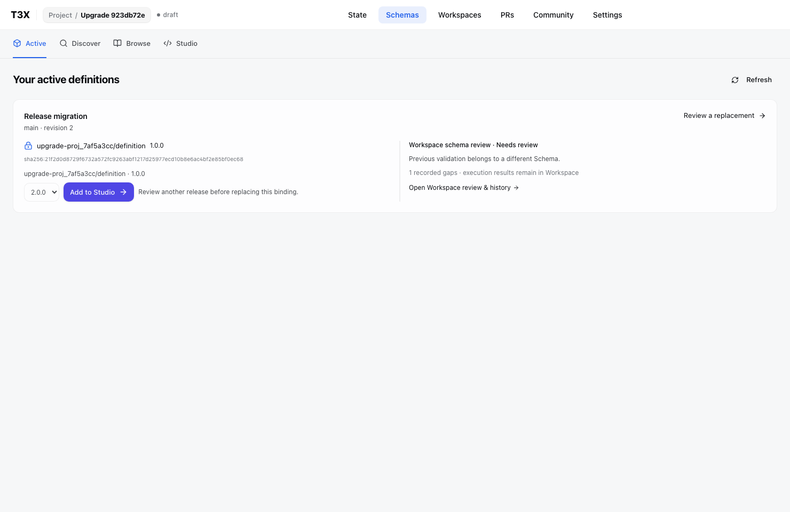
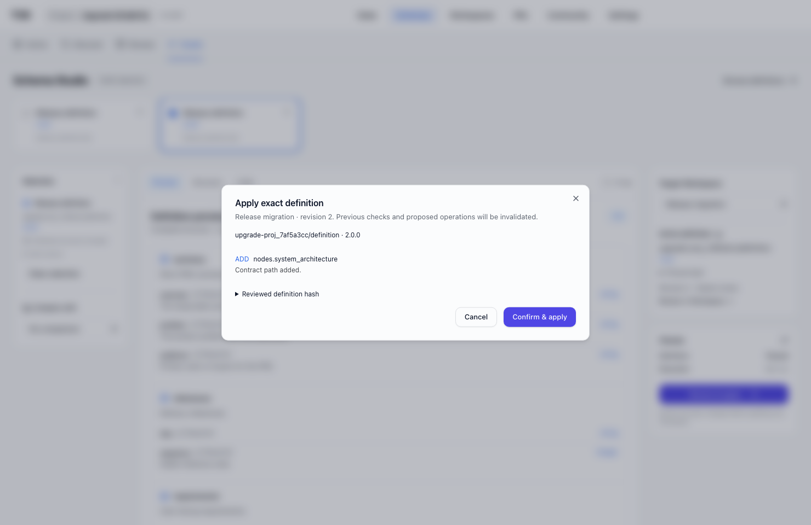
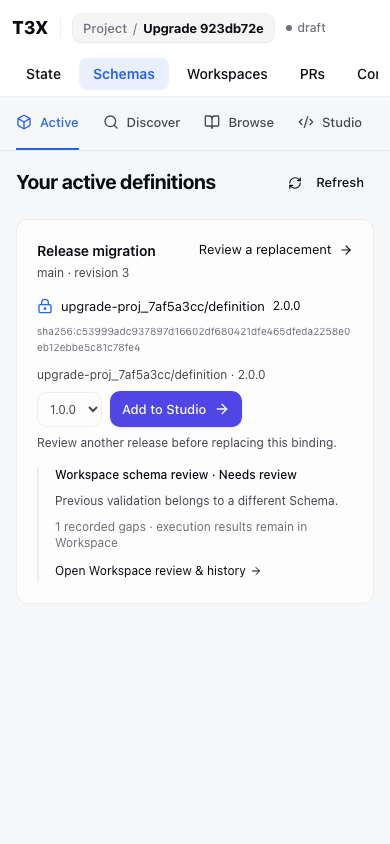

# Exact release upgrade

Production browser verification, 2026-09-06, isolated database and no external model provider.

Two real published versions of one project-owned definition: v1 with PRD core, v2 with its architecture module. Active locates the exact canonical source, hands the selected release and target Workspace to Studio, and displays the added path before explicit apply. The old saved candidate remains pinned; another Workspace remains unchanged. Applying resets schema review to needs-review. Workspace returns to the current binding and revision through View definition.

This verifies upgrade and repair navigation, not automatic migration or a completed repair. Workspace owns the subsequent edits and native validation; the next no-AI delivery qualification exercises those operations.

Checks: one real browser journey; 11 catalog API tests including exact-name filtering and private visibility; 39 Workspace/Schema component cases plus three handoff cases. Initial fixture failures were branch ownership, missing branch creation, and stale composition revision; fixtures now obey those existing contracts.
