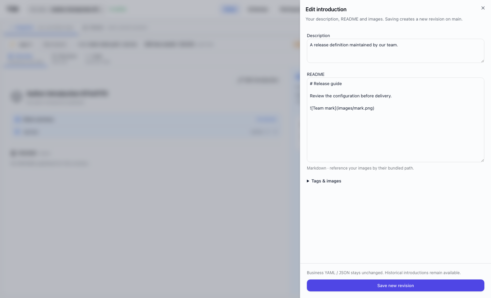
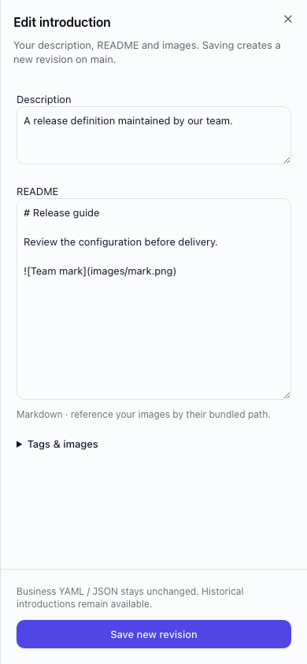
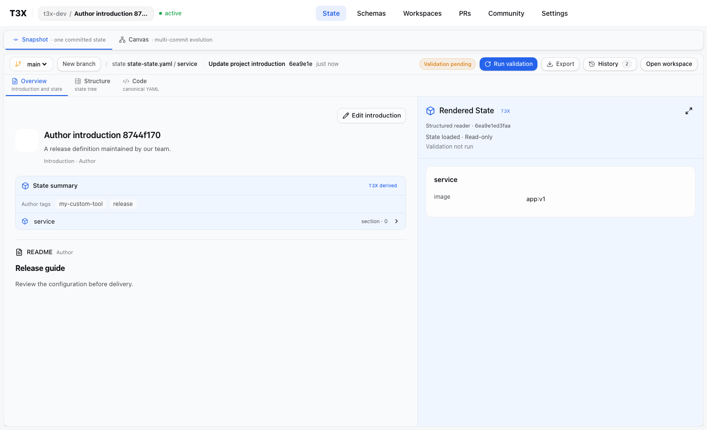

# State author revisions — verification

Baseline: `origin/dev` at `76a2b9a03ad417aaccba55614ee95220d5abfb55`.

An editor can publish description, README, bundled images and loose tags from the current branch head. The existing Transition adapter creates a new CommitV2 with unchanged business State; the immutable presentation is published atomically. Historical introductions remain addressable. Concurrent saves conflict without losing the local draft. Viewer and historical views do not offer authoring.

## Evidence

- Full repository `pnpm test`: 31 tasks successful; API 1,295 passed / 1 skipped, WebUI 1,586 passed.
- Final State component regression run: 31 passed after adding branch refresh on save.
- Real browser smoke: 1 passed, desktop 1480 × 900 and mobile 390 × 844. Exercises upload, actual README/avatar rendering, unchanged JSON export, historical read-only access and concurrent-head draft retention.
- `pnpm check`: passed with the existing two image warnings.
- Screenshots inspected before commit. The uploaded test image is a one-pixel PNG fixture; the blank avatar is intentional test content.

## Failures resolved

Initial assertions found a stale-head fixture, an error color outside semantic tokens, and form labels that became ambiguous with populated values. Browser focus refresh also exposed a snapshot remount that discarded drafts; snapshot loading now keys off the selected head, with a regression test. The composition route suite lacked its isolated database fixture; this is repaired. One concurrent browser/API test startup exhausted PostgreSQL shared-memory resources; the final browser run was serial and shut down all owned services cleanly.

