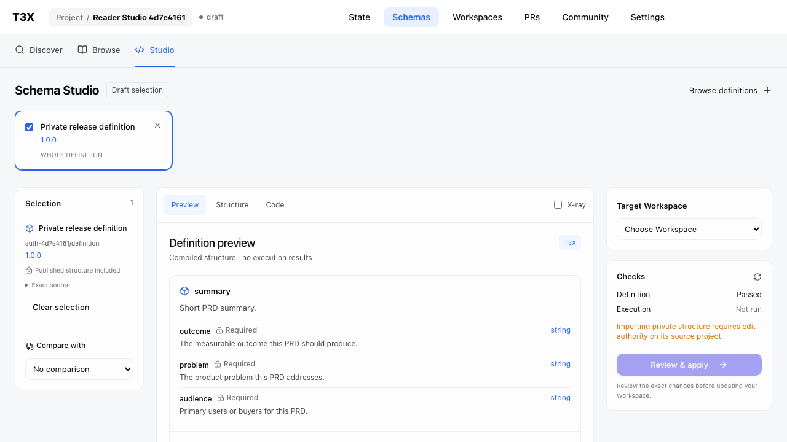
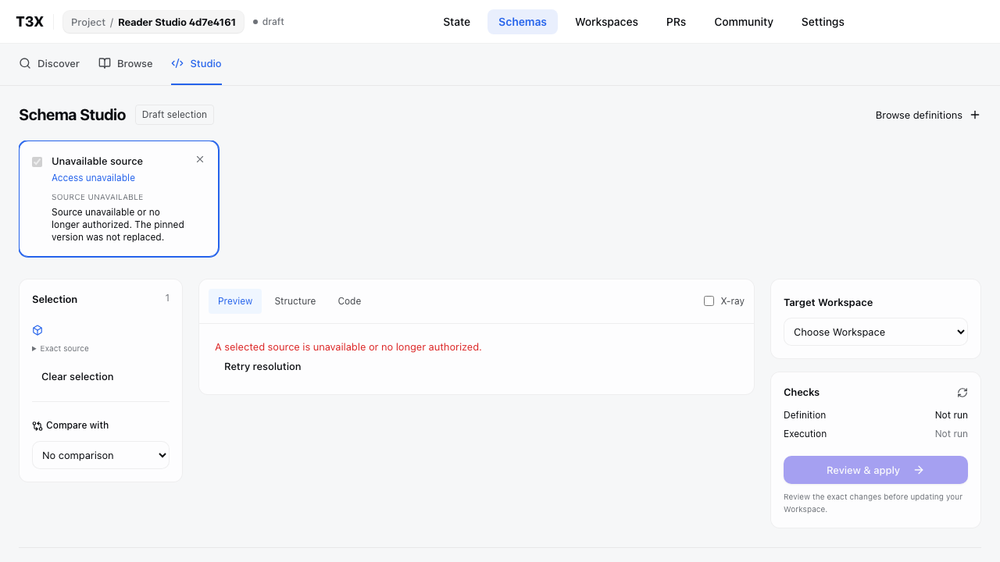

# Authenticated Studio qualification

Verified 2026-09-06 against a production build with authentication enabled and an isolated PostgreSQL database. No mocked browser requests or external model providers.

- Two real registered accounts and independent personal namespaces.
- Private source is concealed before a project viewer grant; after the grant its exact old published release can be saved and previewed.
- Source read authority does not grant private cross-project adoption; target viewer cannot add candidates.
- Revocation redacts saved candidate content and rejects further preview. No replacement with latest.
- Project ID deep links retain the project and Studio query context without assuming membership of the default namespace. Owner/repository routes remain available.

The browser exercise exposed two API bugs: source reads inherited POST edit authority, and published definitions were checked against the pre-publication compiler hash. Studio now explicitly reads the source and checks the published schema against `registry.schemaHash`; the entire pinned manifest is still checked against its artifact digest. Regression cases reject missing or incorrect published schema digests.

Validation: 4 authenticated browser cases, 24 targeted WebUI cases, 1,320 API cases passed (one existing skip). Final header screenshot refreshed in another passing authenticated Studio run.
