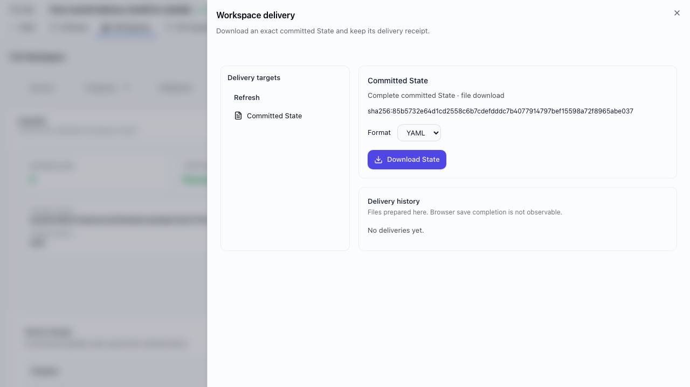
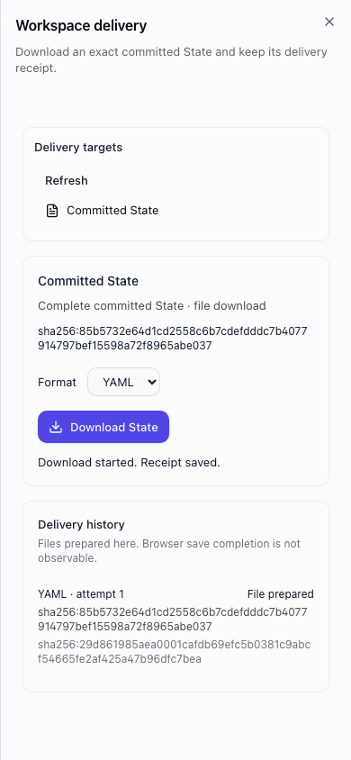

# Workspace delivery — first adapter

Implements #1505 under #1499. Workspace → Delivery prepares a download of the
workspace's exact last committed State. The normal State and Commit Export
buttons remain available independently.

## Target mapping

- `t3x:committed-state` is a reserved built-in target for complete JSON/YAML State
  downloads. It works even when all saved output targets require generation.
- Saved `export` targets in JSON/YAML are supported only when they contain no
  generation instruction, Leaf type, source scope, or constraints.
- Other targets remain visible as Legacy with the incompatibility reason.
  Opening, selecting, or refreshing a target never executes it or creates a Leaf.
- No stored target configuration is rewritten. The legacy generation mapper and
  historical Leaf APIs remain for the separately gated retirement issues.

## Evidence and authority

GET `/v1/projects/{projectId}/workspaces/{workspaceId}/deliveries` projects the
current workspace revision, exact commit, supported/legacy targets, and latest
50 receipts. It requires project read authority.

POST on the same route requires project edit authority because it persists
shared workspace evidence. The request contains target, exact commit, format,
workspace revision, and an idempotency UUID. A new request must match the current
workspace revision and last committed hash; it does not follow branch HEAD.
Commit graph membership and integrity are verified before serialization.

Schema v73 adds `workspace_deliveries`, separate from CommitV2. Each receipt
records project/workspace, target, commit, artifact SHA-256, adapter
`t3x.download/v1`, request identity, attempt, retry lineage, and timestamp.
No artifact body, adapter secrets, or raw exception messages are stored there.

`prepared` means the exact bytes were prepared; it does not mean deployed or
saved to disk. The browser validates the response's source, format, byte length,
and hash before starting its download. Network failure leaves the client with
an unknown outcome; Retry reuses the UUID. A recorded preparation failure is
retried explicitly with a new UUID and `retryOf`. Concurrent duplicates share
one receipt. Replays retain their original commit even after the workspace
revision changes. This adapter has no remote execution.

## Verification

- Application: 7 target compatibility cases.
- API with PostgreSQL: concurrency, mismatched requests, legacy rejection,
  workspace revisions, failure/retry, cross-project and viewer/editor authority.
- Storage: v72 upgrade, first-run bootstrap, receipt constraints, existing data
  preservation; 17 migration tests.
- Web: target selection without execution, receipt status, transport retry,
  duplicate click, refresh, and existing Workspace flows; 35 tests.
- API client: runtime receipt validation; full client suite.
- Production Playwright: real commit → Workspace Delivery → YAML download,
  byte-for-byte comparison with exact State export, repeat download with one
  receipt, desktop/mobile screenshots, no browser errors.

