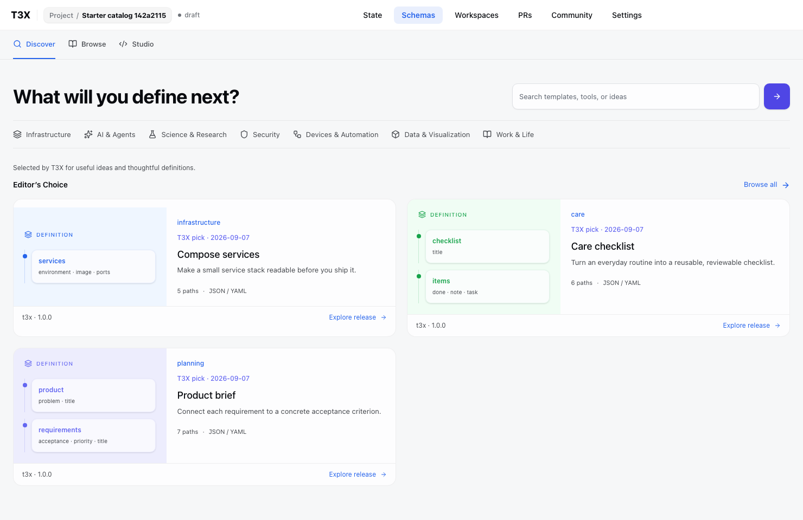
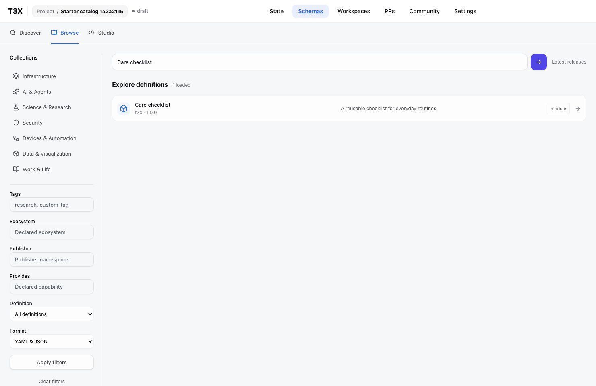

# Editor’s Choice — 2026-09-07

Discover now requests a reviewed selection, rather than calling the newest releases editorial picks. Browse remains the complete permission-aware, searchable catalog.

## Editorial contract

Edit `packages/api/src/lib/schema-editor-picks.ts` through a normal PR. Each entry names an exact canonical identity, version and content hash, a short recommendation reason, editor and selection date. Array order is presentation order; at most 12 entries are considered. Request `limit` bounds the returned selection; there is no editorial pagination. Use Browse for the full catalog.

Selection criteria: a useful or surprising application, a definition that can be understood quickly, original or properly attributed content, clear licensing, and an honest preview. Consider recent saves/likes as future discovery signals only after real measurements exist. Popularity and publishing time do not confer editorial endorsement; authors cannot obtain it by adding tags. Sponsored placement must not be silently treated as editorial.

The initial review proposes three repository-authored, Apache-2.0 starters: Compose services, Care checklist and Product brief. Publishing a newer release does not change a pick. Missing, private, withdrawn or hash-mismatched releases are omitted using the normal storage visibility/lifecycle filters, including for signed-in readers. The project catalog still requires access to its destination project.

Editorial copy is separate from author metadata and from the immutable definition. It never implies a renderer, adapter, successful validation or deployment. A source without an author cover uses the existing T3X-derived structure preview.

## Actual form and design comparison

Compared side by side with [the approved Discover reference](../../plans/state-schema-delivery-2026-09-05/01-discover.png): the headline/search, loose category row, two-column visual cards and compact release footer remain. T3X recommendation attribution is explicit. The real catalog starts with three working definitions, not the reference’s six hypothetical OSS integrations. No stock illustrations, invented usage counts or integrations were added.

Search moves to the dense Browse list; opening a release retains exact source/version and the existing introduction → Add to Studio flow.

## Verification

- Catalog integration: 14 tests against disposable PostgreSQL, including public visibility, reviewed order, exact-version stability when a newer release exists, and mixed editorial/search rejection.
- Catalog UI: 4 tests, including the editorial query and search-to-Browse journey.
- Real production Web/API browser: Discover → Browse → introduction → Studio; authored sample validation, invalid-input repair and mobile Studio. No page exceptions or model calls.
- API surface verification and repository check passed; two pre-existing image-optimization warnings remain.
- Production API and Web builds passed. Local database/Turbopack checks require ordinary host process permissions; the first sandbox-only attempts could not allocate shared memory/bind ports.

This is editorial curation, not a search-engine indexing/ranking system or a popularity algorithm.
